# The Archimedean Solids (Semi-Regular Convex Polyhedra)

**Named after the ancient Greek polymath Archimedes of Syracuse (~287 – ~212 BC), whose lost treatise describing all thirteen solids was recorded and preserved by Pappus of Alexandria in Book V of the *Synagoge* (~4th century AD).**

---

## 1. Historical & Mathematical Context

Archimedes discovered that by systematically truncating (slicing corners from) the Platonic solids and cantellating (expanding edges), one could produce a family of thirteen strictly convex polyhedra whose faces are all regular polygons, but of two or more different kinds.

The original work of Archimedes was lost during the Middle Ages, but Johannes Kepler fully reconstructed the complete set of thirteen solids in *Harmonices Mundi* (1619), coining the modern Latin names still in standard use today (such as *cuboctahedron*, *rhombicuboctahedron*, and the chiral *snub cube* and *snub dodecahedron*).

---

## 2. Defining Axioms & Rules

To qualify as an Archimedean solid, a polyhedron must satisfy all of the following rules:

1. **Regular Faces ($\ge 2$ types)**: Every face is a regular polygon, and the polyhedron must possess at least two distinct kinds of regular polygons.
2. **Vertex-Transitivity (Isogonality)**: All vertices are uniform—the exact same cyclic sequence of polygons meets at every single vertex.
3. **Strict Convexity**: All dihedral angles are strictly convex ($< 180^\circ$).
4. **Non-Prismatic Exclusion**: The infinite families of uniform regular prisms ($n$-gonal prisms) and uniform regular antiprisms ($n$-gonal antiprisms) are excluded, leaving exactly thirteen exceptional polyhedra.

---

## 3. The 13 Archimedean Solids Table

| Index | Preview | Name | Vertex Figure | Vertices ($V$) | Edges ($E$) | Faces ($F$) | Face Breakdown | Dual Catalan Solid |
| :---: | :---: | :--- | :---: | :---: | :---: | :---: | :--- | :--- |
| **$A_1$** | 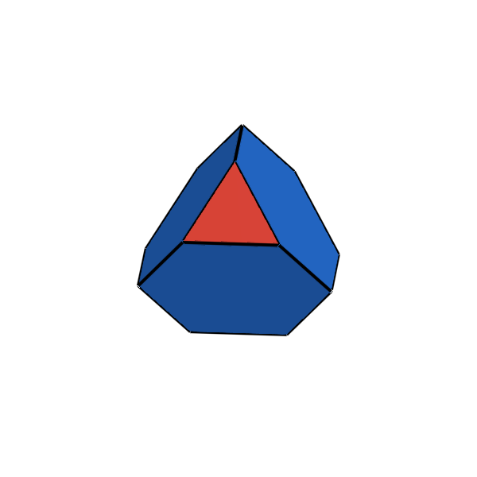 | **Truncated Tetrahedron** | $3 \cdot 6^2$ | 12 | 18 | 8 | 4 Triangles, 4 Hexagons | Triakis Tetrahedron |
| **$A_2$** | 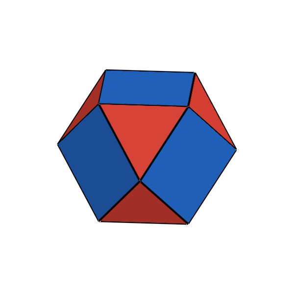 | **Cuboctahedron** | $(3 \cdot 4)^2$ | 12 | 24 | 14 | 8 Triangles, 6 Squares | Rhombic Dodecahedron |
| **$A_3$** | 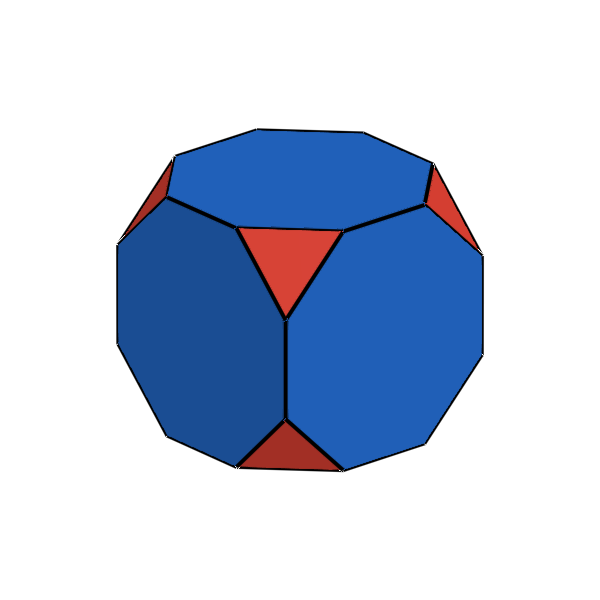 | **Truncated Cube** | $3 \cdot 8^2$ | 24 | 36 | 14 | 8 Triangles, 6 Octagons | Triakis Octahedron |
| **$A_4$** | 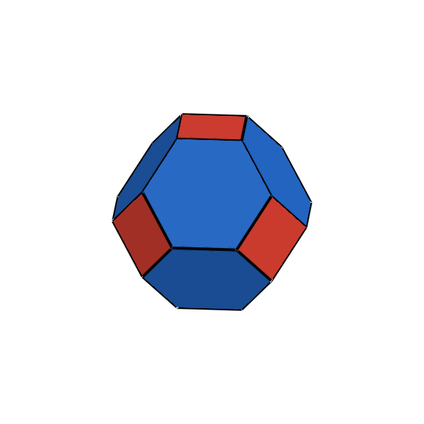 | **Truncated Octahedron** | $4 \cdot 6^2$ | 24 | 36 | 14 | 6 Squares, 8 Hexagons | Tetrakis Hexahedron |
| **$A_5$** | 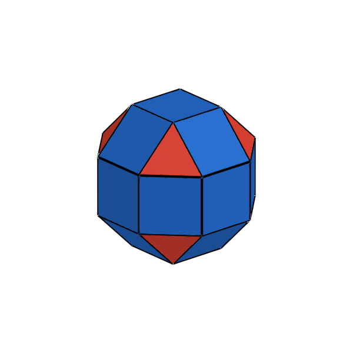 | **Rhombicuboctahedron** | $3 \cdot 4^3$ | 24 | 48 | 26 | 8 Triangles, 18 Squares | Deltoidal Icositetrahedron |
| **$A_6$** | 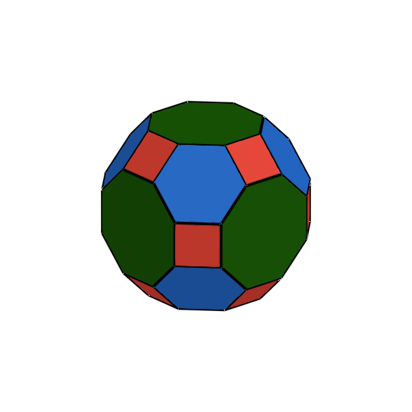 | **Truncated Cuboctahedron** | $4 \cdot 6 \cdot 8$ | 48 | 72 | 26 | 12 Squares, 8 Hexagons, 6 Octagons | Disdyakis Dodecahedron |
| **$A_7$** | 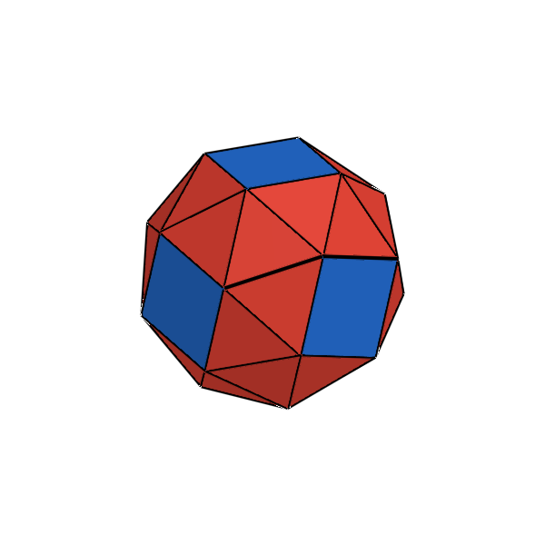 | **Snub Cube** (Chiral) | $3^4 \cdot 4$ | 24 | 60 | 38 | 32 Triangles, 6 Squares | Pentagonal Icositetrahedron |
| **$A_8$** | 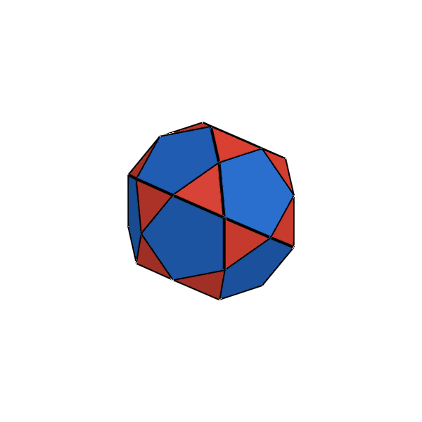 | **Icosidodecahedron** | $(3 \cdot 5)^2$ | 30 | 60 | 32 | 20 Triangles, 12 Pentagons | Rhombic Triacontahedron |
| **$A_9$** | 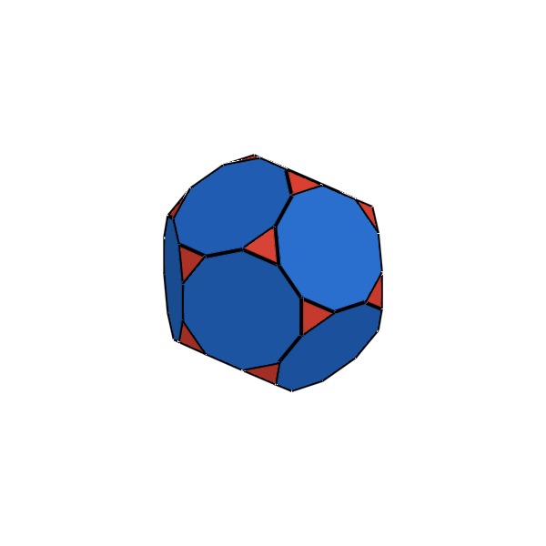 | **Truncated Dodecahedron** | $3 \cdot 10^2$ | 60 | 90 | 32 | 20 Triangles, 12 Decagons | Triakis Icosahedron |
| **$A_{10}$** | 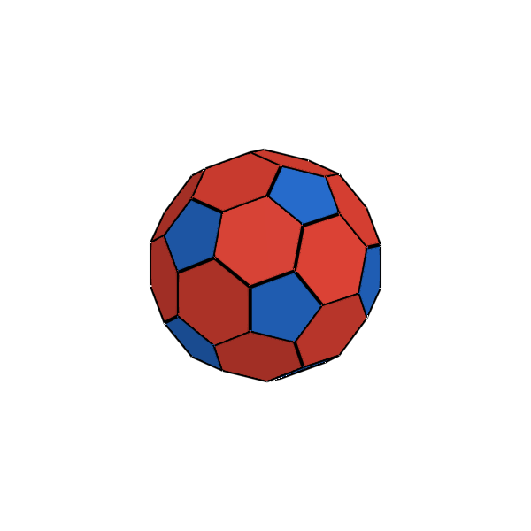 | **Truncated Icosahedron** (Buckyball graph) | $5 \cdot 6^2$ | 60 | 90 | 32 | 12 Pentagons, 20 Hexagons | Pentakis Dodecahedron |
| **$A_{11}$** | 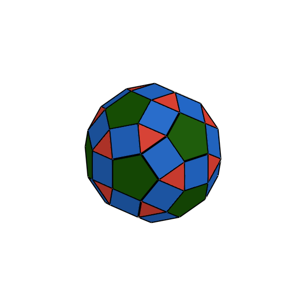 | **Rhombicosidodecahedron** | $3 \cdot 4 \cdot 5 \cdot 4$ | 60 | 120 | 62 | 20 Triangles, 30 Squares, 12 Pentagons | Deltoidal Hexecontahedron |
| **$A_{12}$** | 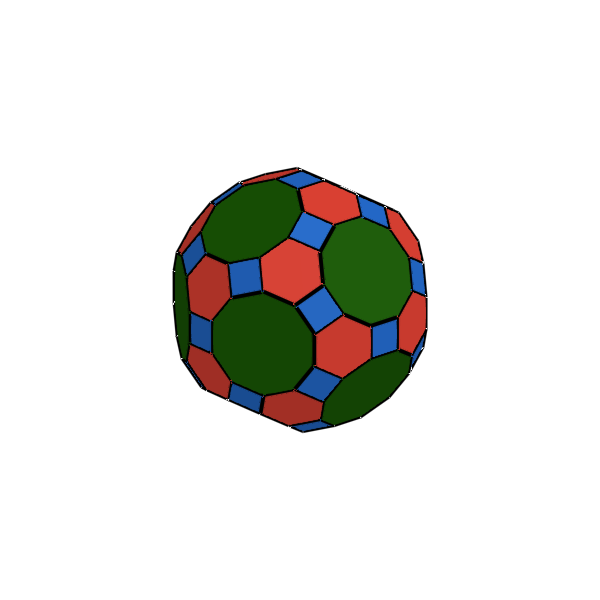 | **Truncated Icosidodecahedron** | $4 \cdot 6 \cdot 10$ | 120 | 180 | 62 | 30 Squares, 20 Hexagons, 12 Decagons | Disdyakis Triacontahedron |
| **$A_{13}$** | 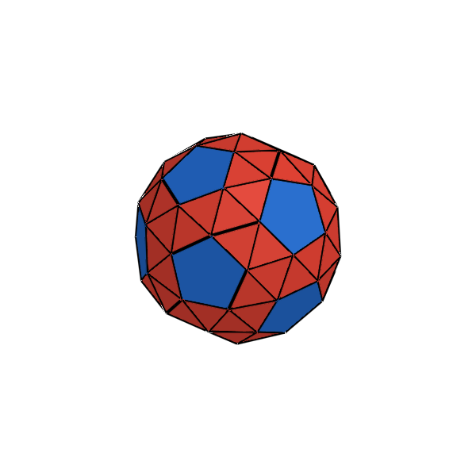 | **Snub Dodecahedron** (Chiral) | $3^4 \cdot 5$ | 60 | 150 | 92 | 80 Triangles, 12 Pentagons | Pentagonal Hexecontahedron |

---

## 4. Julia API Usage

```julia
using Unihedron

# Access by dedicated constructor
co = cuboctahedron()
ti = truncated_icosahedron()   # Classical soccer ball / C60 carbon cage
sc = snub_cube()

# Access by index or symbol dispatcher
a2 = archimedean(2)                   # Cuboctahedron (index 1 to 13)
a10 = archimedean(:truncated_icosahedron)

# Dual relation (Archimedean dual is a Catalan solid)
rd = dual(cuboctahedron())             # Rhombic Dodecahedron
```
