# The Catalan Solids (Archimedean Dual Polyhedra)

**Named after the Belgian mathematician Eugène Charles Catalan (1814–1894), who first published the complete classification of the thirteen Archimedean duals in his 1865 memoir *Mémoire sur la Théorie des Polyèdres*.**

---

## 1. Historical & Mathematical Context

While the Archimedean solids are isogonal (vertex-transitive) with regular faces of varying shapes, their polar duals—the **Catalan solids**—are **isohedral (face-transitive)** with vertices of varying degrees.

Catalan rigorously calculated their dihedral angles, inradii, and coordinate structures in 1865. Because all faces of a Catalan solid are congruent, these shapes are widely utilized in probability and gaming as fair $n$-sided dice (e.g., the 24-sided *deltoidal icositetrahedron* and the 120-sided *disdyakis triacontahedron*). Two Catalan solids (*pentagonal icositetrahedron* and *pentagonal hexecontahedron*) are chiral, existing in distinct left-handed and right-handed enantiomorphs.

---

## 2. Defining Axioms & Rules

To qualify as a Catalan solid, a polyhedron must satisfy all of the following rules:

1. **Face-Transitivity (Isohedry)**: The symmetry group acts transitively on its faces; every face is geometrically congruent and equivalent under symmetry.
2. **Dual of an Archimedean Solid**: Every Catalan solid is the exact polar dual of one of the thirteen Archimedean solids.
3. **Strict Convexity**: All dihedral angles are strictly convex ($< 180^\circ$).
4. **Non-Regular Faces**: Because faces are non-regular (e.g. isosceles triangles, kites, or irregular pentagons), Catalan solids have multiple distinct vertex valence configurations.
5. **Non-Prismatic Dual Exclusion**: The infinite dual families of bipyramids (dual to prisms) and trapezohedra (dual to antiprisms) are excluded.

---

## 3. The 13 Catalan Solids Table

| Index | Preview | Name | Dual Archimedean Solid | Vertices ($V$) | Edges ($E$) | Faces ($F$) | Face Shape |
| :---: | :---: | :--- | :--- | :---: | :---: | :---: | :--- |
| **$C_1$** | 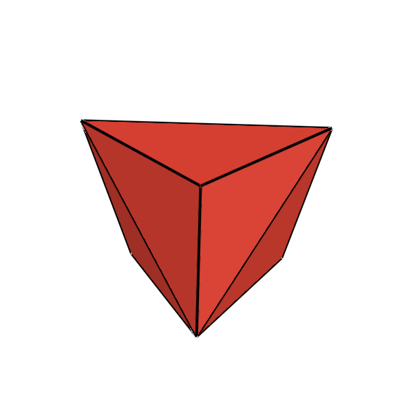 | **Triakis Tetrahedron** | Truncated Tetrahedron | 8 | 18 | 12 | Isosceles Triangles |
| **$C_2$** | 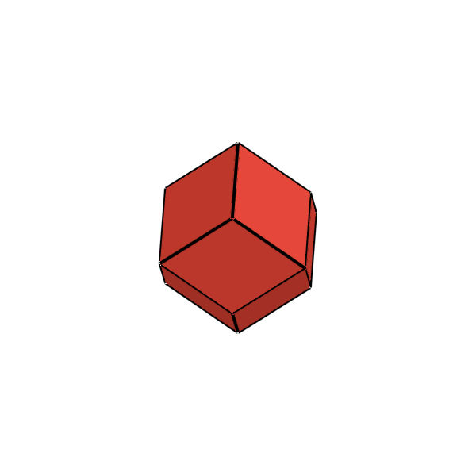 | **Rhombic Dodecahedron** | Cuboctahedron | 14 | 24 | 12 | Rhombi |
| **$C_3$** | 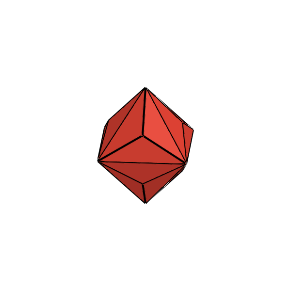 | **Triakis Octahedron** | Truncated Cube | 14 | 36 | 24 | Isosceles Triangles |
| **$C_4$** | 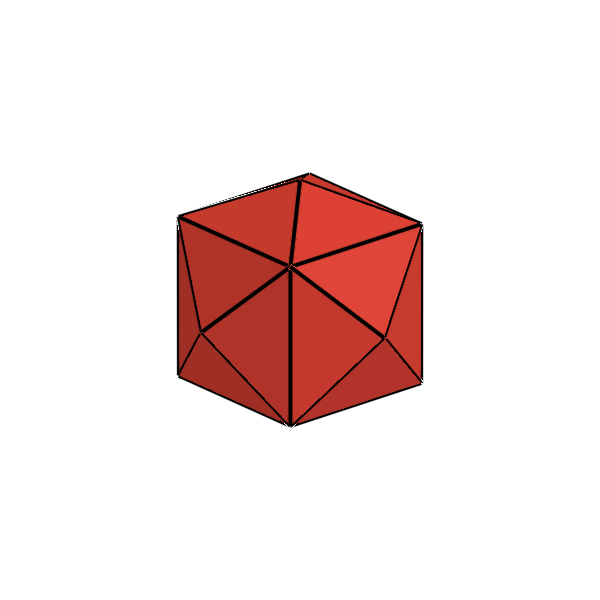 | **Tetrakis Hexahedron** | Truncated Octahedron | 14 | 36 | 24 | Isosceles Triangles |
| **$C_5$** | 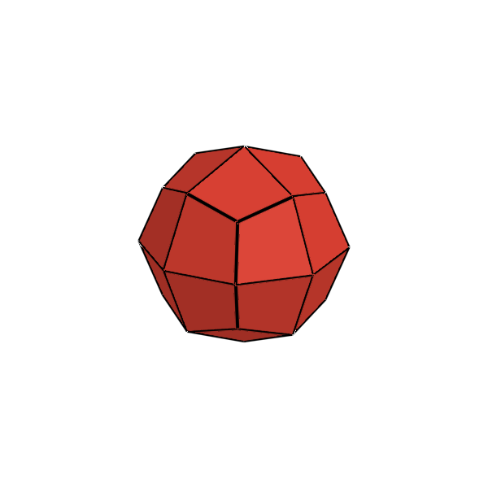 | **Deltoidal Icositetrahedron** | Rhombicuboctahedron | 26 | 48 | 24 | Kites (Deltoids) |
| **$C_6$** | 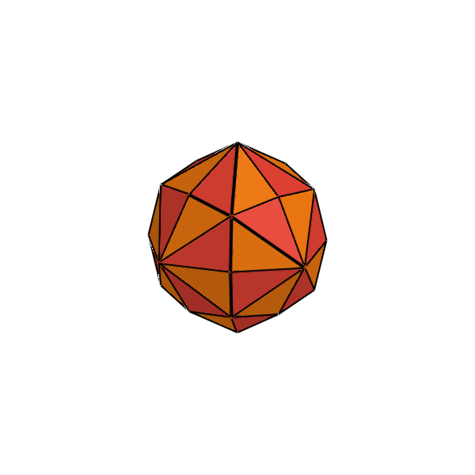 | **Disdyakis Dodecahedron** | Truncated Cuboctahedron | 26 | 72 | 48 | Scalene Triangles |
| **$C_7$** | 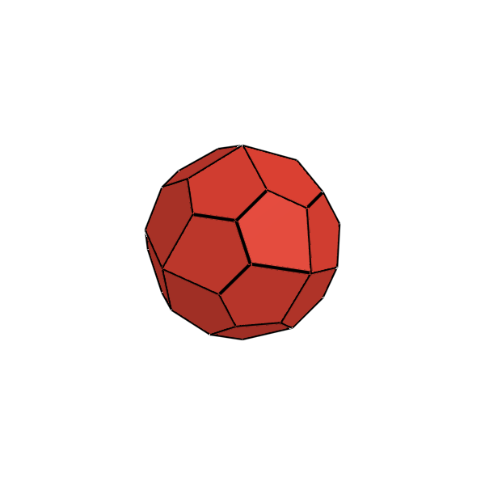 | **Pentagonal Icositetrahedron** (Chiral) | Snub Cube | 38 | 60 | 24 | Skew Pentagons |
| **$C_8$** | 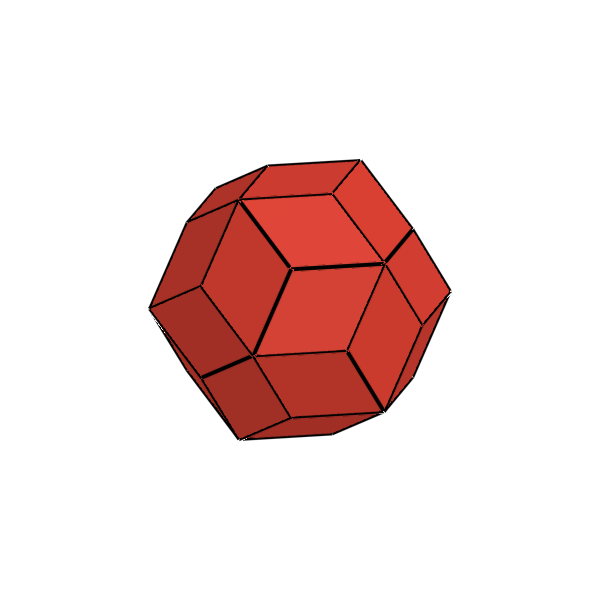 | **Rhombic Triacontahedron** | Icosidodecahedron | 32 | 60 | 30 | Golden Rhombi |
| **$C_9$** | 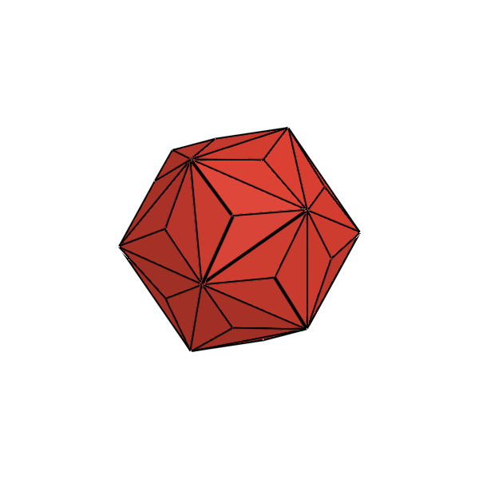 | **Triakis Icosahedron** | Truncated Dodecahedron | 32 | 90 | 60 | Isosceles Triangles |
| **$C_{10}$** | 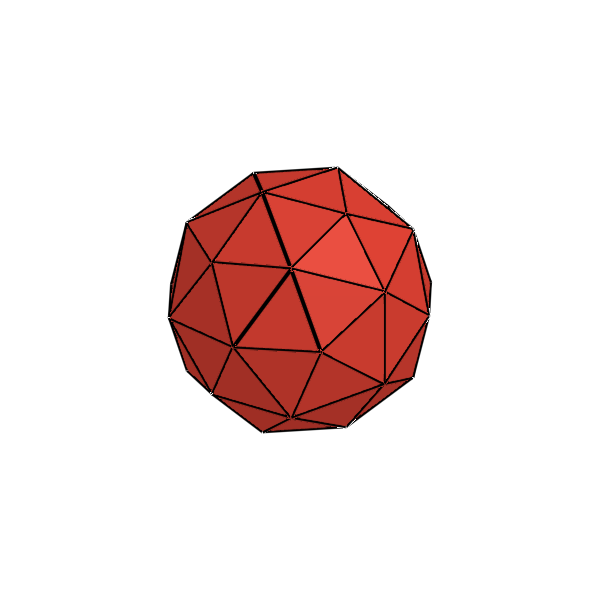 | **Pentakis Dodecahedron** | Truncated Icosahedron | 32 | 90 | 60 | Isosceles Triangles |
| **$C_{11}$** | 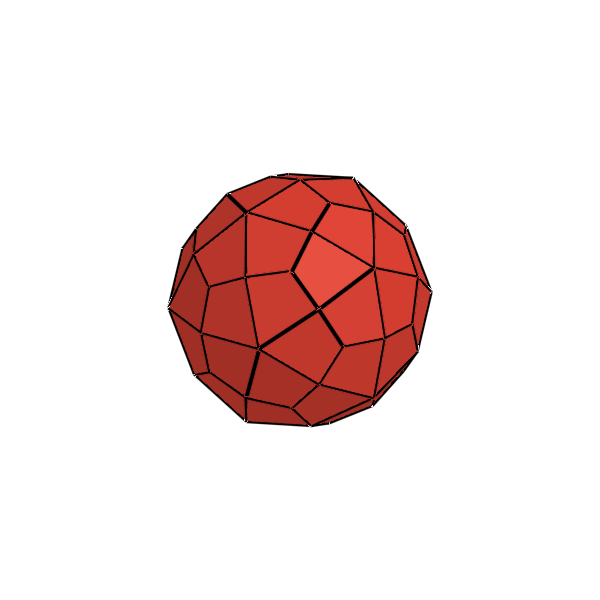 | **Deltoidal Hexecontahedron** | Rhombicosidodecahedron | 62 | 120 | 60 | Kites (Deltoids) |
| **$C_{12}$** | 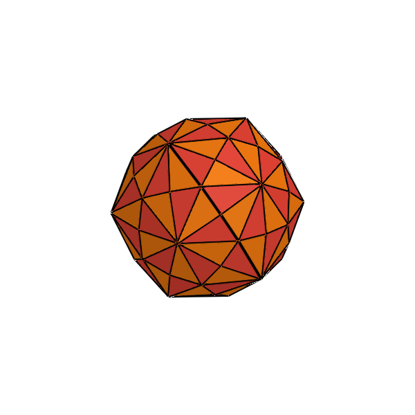 | **Disdyakis Triacontahedron** | Truncated Icosidodecahedron | 62 | 180 | 120 | Scalene Triangles |
| **$C_{13}$** | 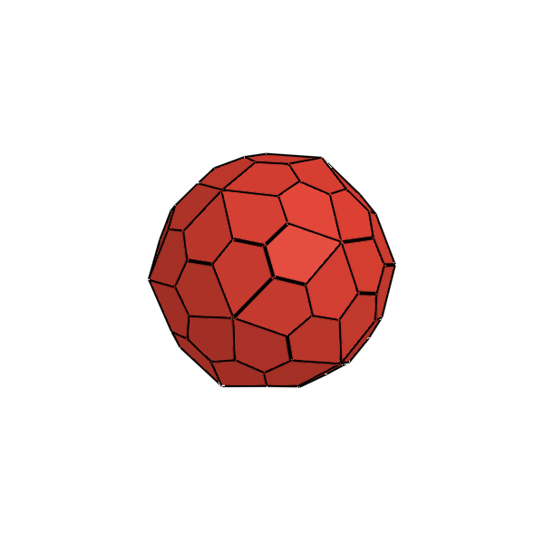 | **Pentagonal Hexecontahedron** (Chiral) | Snub Dodecahedron | 92 | 150 | 60 | Skew Pentagons |

---

## 4. Julia API Usage

```julia
using Unihedron

# Access by dedicated constructor
rd = rhombic_dodecahedron()
di = deltoidal_icositetrahedron()
dt = disdyakis_triacontahedron()   # 120-sided fair die

# Access by index or symbol dispatcher
c2 = catalan(2)                    # Rhombic Dodecahedron (index 1 to 13)
c7 = catalan(:pentagonal_icositetrahedron)

# Dual relation (Catalan dual is an Archimedean solid)
cubo = dual(rhombic_dodecahedron())
```
