# The Cookson Solids (Topological Regimes)

**Mathematical framework formalized and concave shadows discovered by Arthur J Cookson and Joel T Harter in 2026.**

---

## 1. Naming & Namespace Updates

* **Prefix Shift ($H$)**: The official prefix for Cookson solids is **$H$** (standing for *Harter*) to strictly avoid namespace collisions with the existing $C$ prefix used for Catalan solids. The sequence is defined as $H_1, H_2, H_3, \dots, H_8$.
* **The `-sphere` vs `-hedron` Suffix Rule**: The suffix `-sphere` is applied only if the polyhedron requires its vertices to be mathematically normalized to the unit sphere from its eponymous base solid (e.g., transforming the Rhombic Triacontahedron into the *Studded Rhombic Triacontasphere*). Polyhedra that were not forcibly normalized from those eponymous solids take the classical **`-hedron`** suffix (e.g., *Studded Octahedron*, *Studded Icosahedron*, *Studded Cuboctahedron*).
* **The "Studded" Nomenclature**: Traditional Greek prefixes (e.g., *triakis*, *tetrakis*, *pentakis*, *disdyakis*) are **strictly banned** in this namespace. The authors are fully aware of this classical Catalan taxonomy, but deliberately reject it. Archaic prefixes are replaced with the intuitive modifier **"Studded"**. This modernizes the geometry and immediately communicates the structural operation (raising/indenting pyramids on base faces) without relying on confusing legacy translations.

---

## 2. The Regime Philosophy

A Cookson Solid is not a single, rigid set of coordinates. It is a **Topological Regime**—a continuous, sliding family of shapes.

* **The Regime is the Shape**: Any two configurations that exist within the same morphing regime are mathematically the same polyhedron. (For example, a stretched rectangular box and a perfect cube belong to the exact same regime; one does not become a new shape just because it got taller).
* **No Canonical Form**: There is no mathematically "correct" or "canonical" version of a regime. Any configuration that satisfies the rules is a valid representation. Defining a reliable way to construct any valid instance of the shape (e.g., "Push Catalan $X$ to a sphere and convex-crease it") is a complete and valid definition of the entire regime.
* **Presentation is Pragmatic**: While you can pick any point in the regime to illustrate it, some configurations clearly communicate the shape's nature better than others. Presenting a confusing, squashed version is allowed by the rules, but frowned upon by common sense.

---

## 3. The Core Axioms (The Sieve)

To qualify as a Cookson Solid regime, the continuous family must satisfy all of the following rules at every state of its morphing path:

1. **The Spherical Anchor**: Every vertex must lie exactly on the surface of a single sphere.
2. **The Two-Polygon Limit**: The faces of the solid can consist of at most two distinct geometric types. *(Note: Left-handed and right-handed mirror images of an asymmetric face legally count as the same polygon type).*
3. **Strict Topological Graph**: The connectivity of the shape (which vertices connect to form which edges and faces) must remain entirely constant.
4. **Forced Simplification**: The geometry must always be described in its mathematically simplest form. If two adjacent faces become coplanar, they instantly merge into one face. If two vertices occupy the exact same coordinate, they instantly merge into one vertex.
5. **No Self-Intersection**: Faces and edges may not cross through one another.
6. **The Taxonomic Exclusion Rules**:

### The Updated Taxonomic Exclusion Rules
* **Rule A (The Disqualification Gate)**: If the generated spherical regime shares the exact topological graph (vertex/edge/face connectivity) **AND** the same convexity (strictly convex) as an established classical polyhedron (Platonic, Archimedean, Catalan, or Johnson), it is disqualified from the Cookson sequence.
* **Rule B (The Exclusion Roster)**: Disqualified solids are logged in an "Excluded" list (similar to the Johnson sieve exclusions). They take the name of their classical counterpart, applying the "Studded" modifier and replacing `-hedron` with `-sphere`.
* **Rule C (The Concavity Exception)**: If the regime shares a classical graph but possesses different convexity (i.e., it contains any concavity or valley folds, as classical reference shapes are strictly convex), it bypasses Rule A. It is officially numbered and inducted as a true Cookson solid.

---

## 4. Emergent Consequences

If you rigorously apply the axioms above, the following boundaries naturally police the regime without needing to be stated as rules:

* **Concavity is Allowed**: Valley folds are completely legal as long as they don't cause the mesh to self-intersect.
* **Edges Cannot Invert**: An edge can never flip from convex to concave (or vice versa). To do so, the dihedral angle would have to pass through 180° (flat). The exact moment it goes flat, Axiom 4 triggers, the faces merge, the graph breaks, and it exits the regime.
* **Vertices Cannot Collide or Cross**: Moving one vertex onto another triggers Axiom 4, deleting a vertex, altering the graph, and exiting the regime.

---

## 5. The Excluded Solids List ($He_1 - He_4$)

> [!NOTE]
> **Classical Polyhedral Exclusions**: Under **Rule A**, all 5 Platonic solids, several Archimedean solids (such as the cuboctahedron and icosidodecahedron), various Catalan solids, and a number of Johnson solids (e.g., $J_1$ square pyramid, $J_2$ pentagonal pyramid, $J_84$ snub disphenoid) that meet the spherical anchor and $\le 2$ polygon limit are **excluded solely for belonging to those established classical groups**. Not all classical polyhedra that would otherwise qualify under the sieve are cataloged in this table; the four solids below represent the primary spherical Catalan analogues ($He_1 \dots He_4$) that share the topological graphs of classical Catalan solids under convex spherical projection.

These four spherical regimes pass the baseline regime rules but are disqualified under **Rule A** because they share both the topological graph and the convexity of classical Catalan solids. They are indexed as **$He_1 \dots He_4$** for convenient reference:

| Index | Preview | Excluded Solid Name | Derivation / Parent Catalan | Classical Counterpart Graph | Vertices ($V$) | Faces ($F$) |
| :---: | :---: | :--- | :--- | :--- | :---: | :---: |
| **$He_1$** | 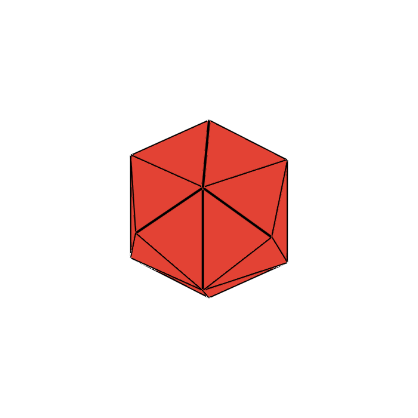 | **Studded Hexasphere** | Convex Rhombic Dodecahedron | Tetrakis Hexahedron | 14 | 24 |
| **$He_2$** | 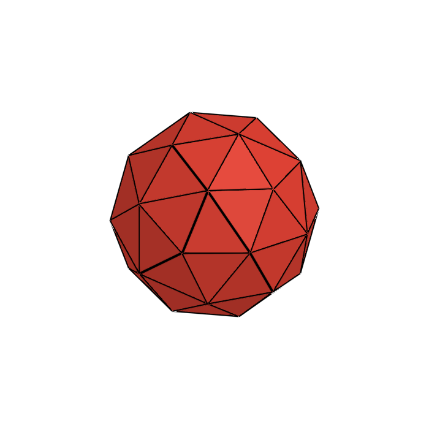 | **Studded Dodecasphere** | Convex Rhombic Triacontahedron | Pentakis Dodecahedron | 32 | 60 |
| **$He_3$** | 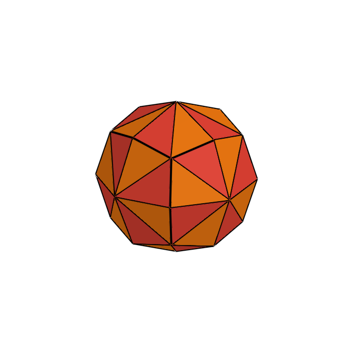 | **Studded Rhombic Dodecasphere** | Convex Deltoidal Icositetrahedron | Disdyakis Dodecahedron | 26 | 48 |
| **$He_4$** |  | **Studded Rhombic Triacontasphere** | Convex Deltoidal Hexecontahedron | Disdyakis Triacontahedron | 62 | 120 |

---

### 5.1 The Infinite Series & Kingdoms (Excluded Generative Families)

Beyond isolated polyhedra, there exist several **infinite series (kingdoms)** of geometric regimes that follow uniform generative rules from one iteration ($n$) to the next. Every member of these infinite families satisfies the Core Axioms (spherical vertex anchor, $\le 2$ polygon limit, strict connectivity, non-self-intersection). However, because they form unbounded infinite progressions rather than isolated, finite exceptional polyhedra, they are taxonomically disqualified from receiving individual numbers in the official Cookson sequence:

1. **The Prismatic Kingdom ($n$-gonal Prisms)**:
   - *Rule*: Two congruent parallel regular $n$-gons joined by a ring of $n$ squares / rectangles.
   - *Polygon Count*: Exactly 2 types ($n$-gons and quadrilaterals).
   - *Spherical Status*: When inscribed on a cylinder within a bounding sphere, all $2n$ vertices lie precisely on the unit sphere.
   - *Exclusion*: Classical infinite uniform series (Archimedean / prismatic).

2. **The Antiprismatic Kingdom ($n$-gonal Antiprisms)**:
   - *Rule*: Two congruent parallel regular $n$-gons, twisted by $\pi/n$, joined by an alternating band of $2n$ equilateral or isosceles triangles.
   - *Polygon Count*: Exactly 2 types ($n$-gons and triangles; for $n=3$, it specializes to the regular octahedron).
   - *Spherical Status*: All $2n$ vertices lie symmetrically on the unit sphere.
   - *Exclusion*: Classical infinite uniform series.

3. **The Pyramidal Kingdom ($n$-gonal Pyramids)**:
   - *Rule*: One regular $n$-gon base joined to an apex by $n$ congruent isosceles triangles.
   - *Polygon Count*: Exactly 2 types ($n$-gon and triangles).
   - *Spherical Status*: When the apex and base vertices are inscribed on a spherical cap, all $n+1$ vertices lie on the sphere.
   - *Exclusion*: Elementary infinite family ($n=3$ is the tetrahedron; $n=4, 5$ are Johnson solids $J_1, J_2$).

4. **The Bipyramidal / Dipyramidal Kingdom ($n$-gonal Bipyramids)**:
   - *Rule*: Two $n$-gonal pyramids joined base-to-base, consisting of $2n$ congruent isosceles triangles.
   - *Polygon Count*: Exactly 1 polygon type ($F=2n$).
   - *Spherical Status*: Catalan duals of prisms; all $n+2$ vertices lie symmetrically on the sphere.
   - *Exclusion*: Infinite dual series ($n=4$ is the regular octahedron).

5. **The Trapezohedral / Deltohedral Kingdom ($n$-gonal Trapezohedra)**:
   - *Rule*: Catalan duals of $n$-gonal antiprisms, consisting of $2n$ congruent kites (deltoids) arranged in an offset staggered ring.
   - *Polygon Count*: Exactly 1 polygon type ($F=2n$ kites).
   - *Spherical Status*: All $2n+2$ vertices lie symmetrically on the sphere.
   - *Exclusion*: Infinite dual series ($n=3$ is the trigonal trapezohedron / rhombohedron).

---

## 6. The Official Cookson Sequence ($H_1 - H_8$)

> [!NOTE]
> **Provisional Indexing & Completeness Note**: 
> - **Provisional Numbering**: The current **$H_\#$ designations are working, provisional indices**. The authors are actively in the middle of exploring, classifying, and unravelling the underlying mathematical patterns and overarching taxonomic families of these topological regimes. As structural patterns are formalized, these assignments may be reorganized into a more comprehensive, systematic family hierarchy.
> - **Completeness**: This roster of 8 known Cookson Solid regimes ($H_1 \dots H_8$) **has not been proven to be complete**. Additional valid topological regimes that satisfy the Core Axioms (The Sieve) and pass the Taxonomic Exclusion rules may yet be discovered.

These are the 8 currently known Cookson solids, passing all regime rules and possessing either an entirely unique topological graph or a concave profile that distinguishes them from classical planar geometry:

| Index | Preview | Official Name | Classification | Suffix Form | Parent Catalan Solid | Classical Graph | Vertices ($V$) | Faces ($F$) | Face Breakdown |
| :---: | :---: | :--- | :--- | :--- | :--- | :--- | :---: | :---: | :--- |
| **$H_1$** | 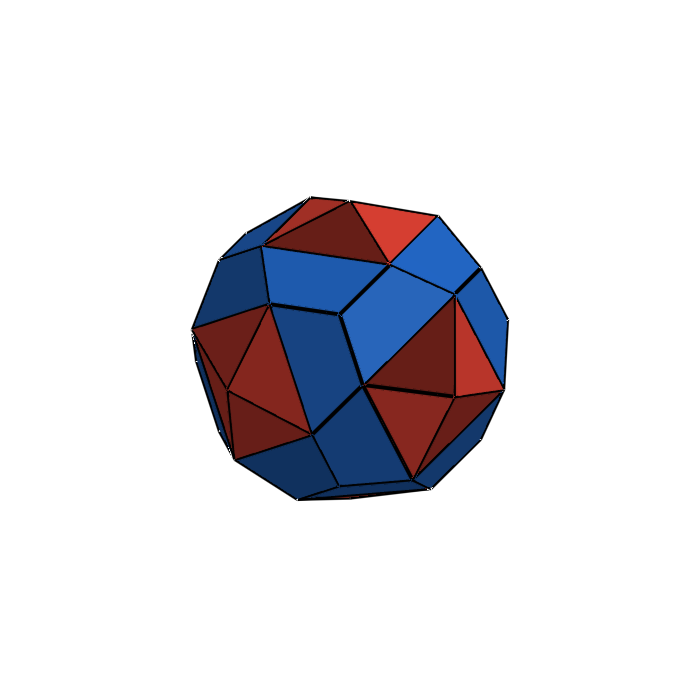 | **Gyrotrapezotrigonal Octasphere** | Convex Irregular | `-sphere` | Pentagonal Icositetrahedron | *Unique* | 38 | 48 | 24 Trapezoids, 24 Triangles |
| **$H_2$** | 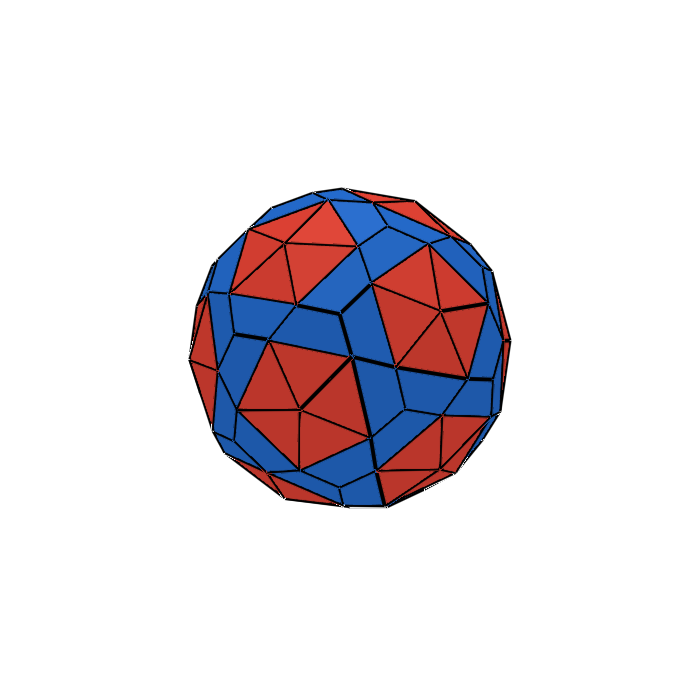 | **Gyrotrapezotrigonal Icosasphere** | Convex Irregular | `-sphere` | Pentagonal Hexecontahedron | *Unique* | 92 | 120 | 60 Trapezoids, 60 Triangles |
| **$H_3$** | 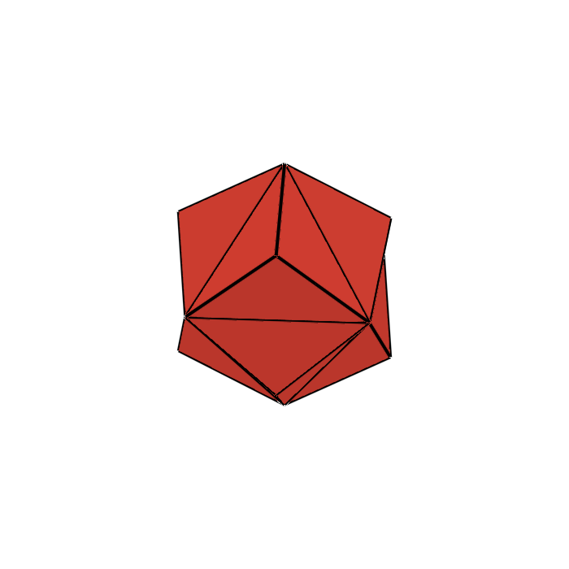 | **Studded Octahedron** | Concave Shadow | `-hedron` | Rhombic Dodecahedron | *Triakis Octahedron* | 14 | 24 | 24 Triangles |
| **$H_4$** | 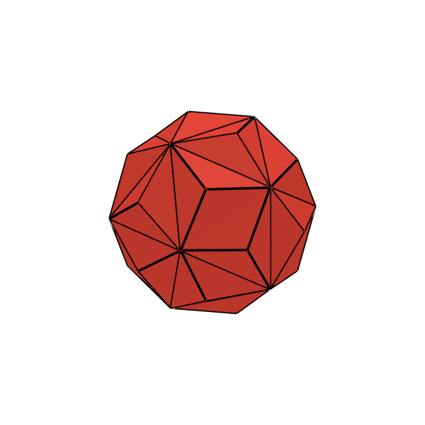 | **Studded Icosahedron** | Concave Shadow | `-hedron` | Rhombic Triacontahedron | *Triakis Icosahedron* | 32 | 60 | 60 Triangles |
| **$H_5$** | 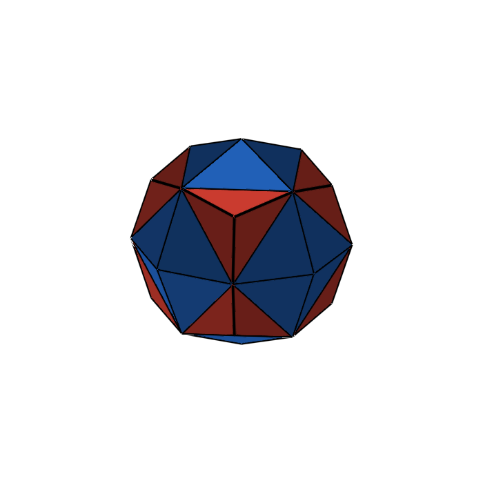 | **Studded Cuboctahedron** | Concave Shadow | `-hedron` | Deltoidal Icositetrahedron | *Disdyakis Cuboctahedron* | 26 | 48 | 48 Triangles (Chiral pairs) |
| **$H_6$** | 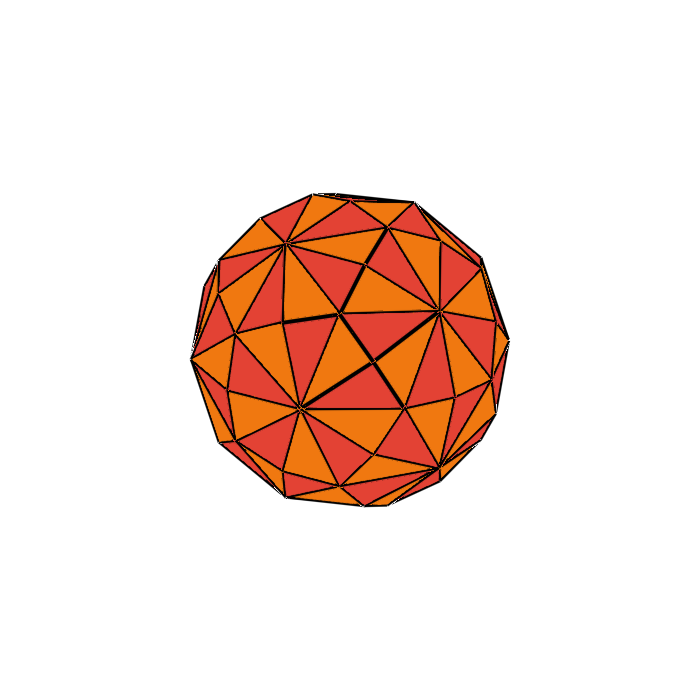 | **Studded Rhombic Triacontasphere** | Concave Shadow | `-sphere` | Deltoidal Hexecontahedron | *Disdyakis Rhombic Triacontahedron* | 62 | 120 | 120 Triangles (Chiral pairs) |
| **$H_7$** | 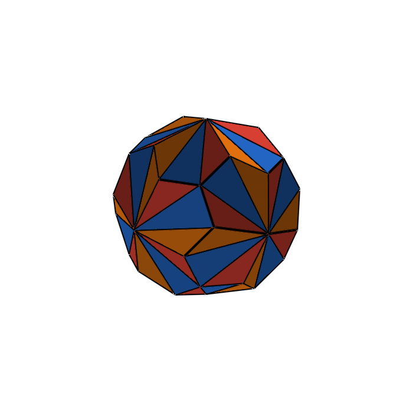 | **Gyrobitrigonal Octasphere** | Concave Irregular | `-sphere` | Pentagonal Icositetrahedron | *Unique* | 38 | 72 | 24 Isosceles, 48 Scalene Triangles |
| **$H_8$** | 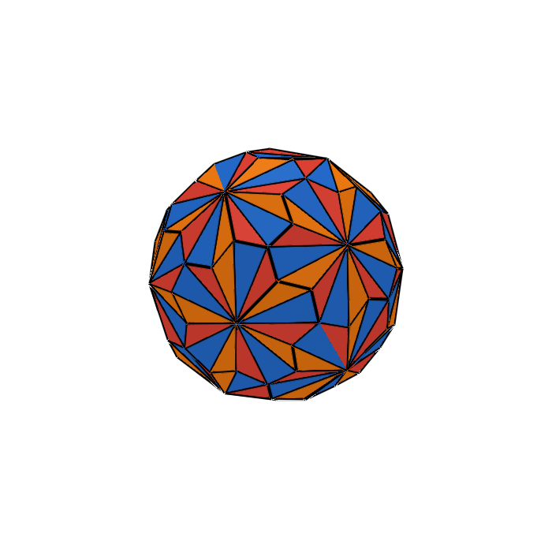 | **Gyrobitrigonal Icosasphere** | Concave Irregular | `-sphere` | Pentagonal Hexecontahedron | *Unique* | 92 | 180 | 60 Isosceles, 120 Scalene Triangles |

---

## 7. Group Breakdowns

### The Convex Irregulars (Unique Graphs)
* **$H_1$: Gyrotrapezotrigonal Octasphere**: Art's original convex Pentagonal Icositetrahedron derivative ($V=38, F=48$).
* **$H_2$: Gyrotrapezotrigonal Icosasphere**: Art's original convex Pentagonal Hexecontahedron derivative ($V=92, F=120$).

### The Concave Shadows (Classical Graphs, Different Convexity)
* **$H_3$: Studded Octahedron**: Concave valley-fold derivative of the Rhombic Dodecahedron ($V=14, F=24$; classical graph: *Triakis Octahedron*). Suffix `-hedron` because it was not forcibly normalized from an octahedron.
* **$H_4$: Studded Icosahedron**: Concave valley-fold derivative of the Rhombic Triacontahedron ($V=32, F=60$; classical graph: *Triakis Icosahedron*). Suffix `-hedron` because it was not forcibly normalized from an icosahedron.
* **$H_5$: Studded Cuboctahedron**: Concave valley-fold derivative of the Deltoidal Icositetrahedron ($V=26, F=48$; classical graph: *Disdyakis Cuboctahedron*). Suffix `-hedron` because it was not forcibly normalized from a cuboctahedron.
* **$H_6$: Studded Rhombic Triacontasphere**: Concave valley-fold derivative of the Deltoidal Hexecontahedron ($V=62, F=120$; classical graph: *Disdyakis Rhombic Triacontahedron*). Suffix `-sphere` because it is normalized from the Rhombic Triacontahedron.

### The Concave Irregulars (Unique Graphs, Unique Convexity)
* **$H_7$: Gyrobitrigonal Octasphere**: Concave valley-fold derivative of the Pentagonal Icositetrahedron ($V=38, F=72$). Created by cutting each skew pentakite from the tip to the lower pair of vertices, fracturing it into 1 central isosceles triangle and 2 mirrored flanking scalene triangles.
* **$H_8$: Gyrobitrigonal Icosasphere**: Concave valley-fold derivative of the Pentagonal Hexecontahedron ($V=92, F=180$). Same 3-triangle pentakite cut applied to the icosahedral parent.

---

## 8. Julia API Usage

### Accessing Solids
```julia
using Unihedron

# By H-index symbol (:H1 to :H8) or integer (1 to 8)
h1 = cookson(:H1)   # H1: Gyrotrapezotrigonal Octasphere (Convex Irregular)
h3 = cookson(:H3)   # H3: Studded Octahedron (Concave Shadow)
h4 = cookson(:H4)   # H4: Studded Icosahedron (Concave Shadow)
h5 = cookson(:H5)   # H5: Studded Cuboctahedron (Concave Shadow)
h6 = cookson(:H6)   # H6: Studded Rhombic Triacontasphere (Concave Shadow)
h7 = cookson(:H7)   # H7: Gyrobitrigonal Octasphere (Concave Irregular)
h8 = cookson(:H8)   # H8: Gyrobitrigonal Icosasphere (Concave Irregular)

# By official constructor names
P1 = gyrotrapezotrigonal_octasphere()
P3 = studded_octahedron()
P4 = studded_icosahedron()
P5 = studded_cuboctahedron()
P6 = studded_rhombic_triacontasphere()
P7 = gyrobitrigonal_octasphere()

# Accessing the Excluded list (by :He1 - :He4 shorthand, integer 1-4, or name)
ex1 = excluded_cookson(:He1)                     # Studded Hexasphere
ex3 = cookson(:He3)                              # Studded Rhombic Dodecasphere
ex_names = excluded_cookson_names()
ex_name2 = excluded_cookson_name(2)              # "Studded Dodecasphere"

# Structural metadata query
info = cookson_info(:H3)
println(info.name)             # "Studded Octahedron"
println(info.group)            # "Concave Shadow"
println(info.classical_graph)  # "Triakis Octahedron"
println(info.parent_catalan)   # "Rhombic Dodecahedron"
```
