# The Cookson Solids (Topological Regimes)

**Mathematical framework formalized and concave shadows discovered by Arthur J Cookson and Joel T Harter in 2026.**

---

## 1. Naming & Namespace Updates

* **Prefix Shift ($H$)**: The official prefix for Cookson solids is **$H$** (standing for *Harter*) to strictly avoid namespace collisions with the existing $C$ prefix used for Catalan solids. The sequence is defined as $H_1, H_2, H_3, \dots, H_8$.
* **The `-sphere` vs `-hedron` Suffix Rule**: The suffix `-sphere` is applied only if the polyhedron requires its vertices to be mathematically normalized to the unit sphere from its eponymous base solid (e.g., transforming the Rhombic Triacontahedron into the *Studded Rhombic Triacontasphere*). Polyhedra that were not forcibly normalized from those eponymous solids take the classical **`-hedron`** suffix (e.g., *Studded Octahedron*, *Studded Icosahedron*, *Studded Cuboctahedron*).
* **The "Studded" Nomenclature**: Traditional Greek prefixes (e.g., *triakis*, *tetrakis*, *pentakis*, *disdyakis*) are **strictly banned** in this namespace. The authors are fully aware of this classical Catalan taxonomy, but deliberately reject it. Archaic prefixes are replaced with the intuitive modifier **"Studded"**. This modernizes the geometry and immediately communicates the structural operation (raising/indenting pyramids on base faces) without relying on confusing legacy translations.

---

## 2. The Regime Philosophy

A Cookson Solid is not a single, rigid set of coordinates. It is a **Topological Regime**—a continuous, sliding family of shapes.

* **The Regime is the Shape**: Any two configurations that exist within the same morphing regime are mathematically the same polyhedron. (For example, a stretched rectangular box and a perfect cube belong to the exact same regime; one does not become a new shape just because it got taller).
* **No Canonical Form**: There is no mathematically "correct" or "canonical" version of a regime. Any configuration that satisfies the rules is a valid representation. Defining a reliable way to construct any valid instance of the shape (e.g., "Push Catalan $X$ to a sphere and convex-crease it") is a complete and valid definition of the entire regime.
* **Presentation is Pragmatic**: While you can pick any point in the regime to illustrate it, some configurations clearly communicate the shape's nature better than others. Presenting a confusing, squashed version is allowed by the rules, but frowned upon by common sense.

---

## 3. The Core Axioms (The Sieve)

To qualify as a Cookson Solid regime, the continuous family must satisfy all of the following rules at every state of its morphing path:

1. **The Spherical Anchor**: Every vertex must lie exactly on the surface of a single sphere.
2. **The Two-Polygon Limit**: The faces of the solid can consist of at most two distinct geometric types. *(Note: Left-handed and right-handed mirror images of an asymmetric face legally count as the same polygon type).*
3. **Strict Topological Graph**: The connectivity of the shape (which vertices connect to form which edges and faces) must remain entirely constant.
4. **Forced Simplification**: The geometry must always be described in its mathematically simplest form. If two adjacent faces become coplanar, they instantly merge into one face. If two vertices occupy the exact same coordinate, they instantly merge into one vertex.
5. **No Self-Intersection**: Faces and edges may not cross through one another.
6. **The Taxonomic Exclusion Rules**:

### The Updated Taxonomic Exclusion Rules
* **Rule A (The Disqualification Gate)**: If the generated spherical regime shares the exact topological graph (vertex/edge/face connectivity) **AND** the same convexity (strictly convex) as an established classical polyhedron (Platonic, Archimedean, Catalan, or Johnson), it is disqualified from the Cookson sequence.
* **Rule B (The Exclusion Roster)**: Disqualified solids are logged in an "Excluded" list (similar to the Johnson sieve exclusions). They take the name of their classical counterpart, applying the "Studded" modifier and replacing `-hedron` with `-sphere`.
* **Rule C (The Concavity Exception)**: If the regime shares a classical graph but possesses different convexity (i.e., it contains any concavity or valley folds, as classical reference shapes are strictly convex), it bypasses Rule A. It is officially numbered and inducted as a true Cookson solid.

---

## 4. Emergent Consequences

If you rigorously apply the axioms above, the following boundaries naturally police the regime without needing to be stated as rules:

* **Concavity is Allowed**: Valley folds are completely legal as long as they don't cause the mesh to self-intersect.
* **Edges Cannot Invert**: An edge can never flip from convex to concave (or vice versa). To do so, the dihedral angle would have to pass through 180° (flat). The exact moment it goes flat, Axiom 4 triggers, the faces merge, the graph breaks, and it exits the regime.
* **Vertices Cannot Collide or Cross**: Moving one vertex onto another triggers Axiom 4, deleting a vertex, altering the graph, and exiting the regime.

---

## 5. The Excluded Solids List ($He_1 - He_4$)

> [!NOTE]
> **Classical Polyhedral Exclusions**: Under **Rule A**, all 5 Platonic solids, several Archimedean solids (such as the cuboctahedron and icosidodecahedron), various Catalan solids, and a number of Johnson solids (e.g., $J_1$ square pyramid, $J_2$ pentagonal pyramid, $J_84$ snub disphenoid) that meet the spherical anchor and $\le 2$ polygon limit are **excluded solely for belonging to those established classical groups**. Not all classical polyhedra that would otherwise qualify under the sieve are cataloged in this table; the four solids below represent the primary spherical Catalan analogues ($He_1 \dots He_4$) that share the topological graphs of classical Catalan solids under convex spherical projection.

These four spherical regimes pass the baseline regime rules but are disqualified under **Rule A** because they share both the topological graph and the convexity of classical Catalan solids. They are indexed as **$He_1 \dots He_4$** for convenient reference:

| Index | Preview | Excluded Solid Name | Derivation / Parent Catalan | Classical Counterpart Graph | Vertices ($V$) | Faces ($F$) |
| :---: | :---: | :--- | :--- | :--- | :---: | :---: |
| **$He_1$** | 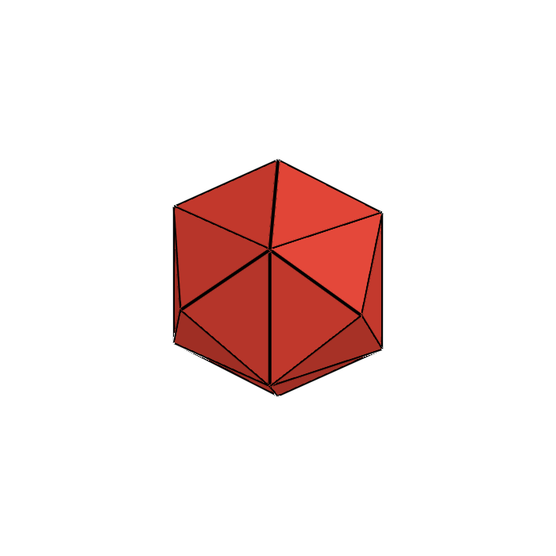 | **Studded Hexasphere** | Convex Rhombic Dodecahedron | Tetrakis Hexahedron | 14 | 24 |
| **$He_2$** |  | **Studded Dodecasphere** | Convex Rhombic Triacontahedron | Pentakis Dodecahedron | 32 | 60 |
| **$He_3$** |  | **Studded Rhombic Dodecasphere** | Convex Deltoidal Icositetrahedron | Disdyakis Dodecahedron | 26 | 48 |
| **$He_4$** | 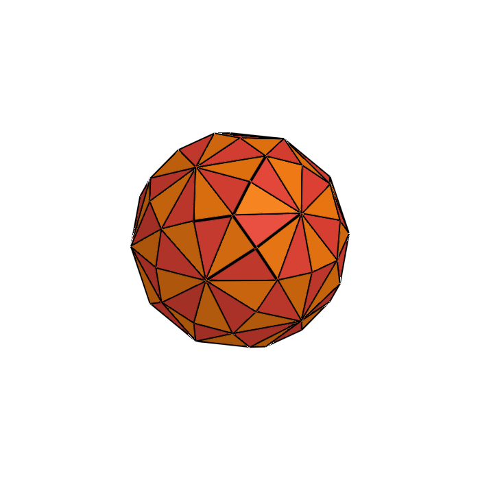 | **Studded Rhombic Triacontasphere** | Convex Deltoidal Hexecontahedron | Disdyakis Triacontahedron | 62 | 120 |

---

### 5.1 The Infinite Phyla (Excluded Generative Families)

Beyond isolated, exceptional polyhedra, there exist **infinite phyla** of geometric regimes that follow uniform generative rules from one iteration to the next. Every member of these infinite phyla satisfies the Core Axioms (spherical vertex anchor, $\le 2$ polygon limit, strict connectivity, non-self-intersection). However, because they form unbounded infinite progressions rather than isolated, finite exceptional polyhedra, they are taxonomically disqualified from receiving individual numbers in the official Cookson sequence.

These infinite families fall into two broad structural classes:
1. **1-Variable Infinite Families (Rotational Base Order $n$)**: Classical and studded prismatic, antiprismatic, bipyramidal, and trapezohedral series.
2. **2-Variable Infinite Groups (Dual Breakdown Indices $(m, n)$)**: Geodesic Spheres and Goldberg Solids.

To illustrate the 1-variable families, their **heptagonal ($n=7$) regimes** are rendered below:

#### 1-Variable Classical Phyla
| Phylum | Heptagonal ($n=7$) Exemplar | Generative Rule & Structure | Polygon Count & Breakdown | Spherical Anchor Status | Classical Exclusion Rationale |
| :--- | :---: | :--- | :--- | :--- | :--- |
| **The Prismatic Phylum** | 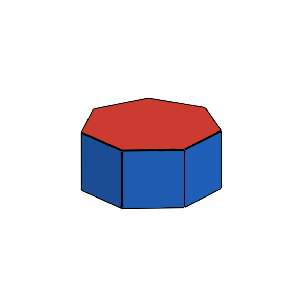 | Two congruent parallel regular $n$-gons joined by a lateral ring of $n$ quadrilaterals / squares. | Exactly 2 types:<br>• 2 $n$-gons<br>• $n$ squares | When inscribed on a cylinder within a bounding sphere, all $2n$ vertices lie precisely on the unit sphere. | Classical infinite uniform series (Archimedean / prismatic). |
| **The Antiprismatic Phylum** | 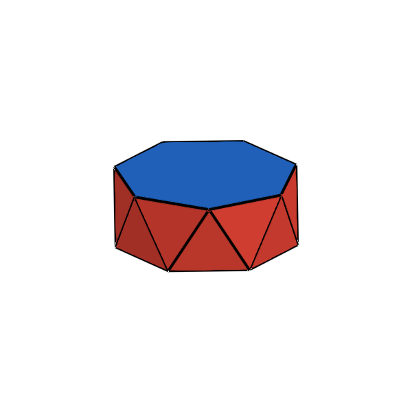 | Two congruent parallel regular $n$-gons, twisted by $\pi/n$, joined by an alternating band of $2n$ equilateral or isosceles triangles. | Exactly 2 types:<br>• 2 $n$-gons<br>• $2n$ triangles | All $2n$ vertices lie symmetrically on the circumscribed unit sphere. | Classical infinite uniform series ($n=3$ specializes to the regular octahedron). |
| **The Pyramidal Phylum** | 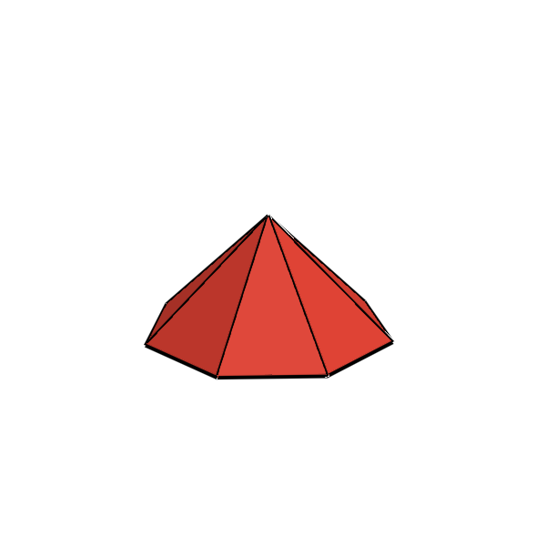 | One regular $n$-gon base joined to a polar apex by $n$ congruent isosceles triangles. | Exactly 2 types:<br>• 1 $n$-gon<br>• $n$ triangles | When the apex and base vertices are inscribed on a spherical cap, all $n+1$ vertices lie on the sphere. | Elementary infinite family ($n=3$ is the tetrahedron; $n=4, 5$ are Johnson solids $J_1, J_2$). |
| **The Bipyramidal Phylum** | 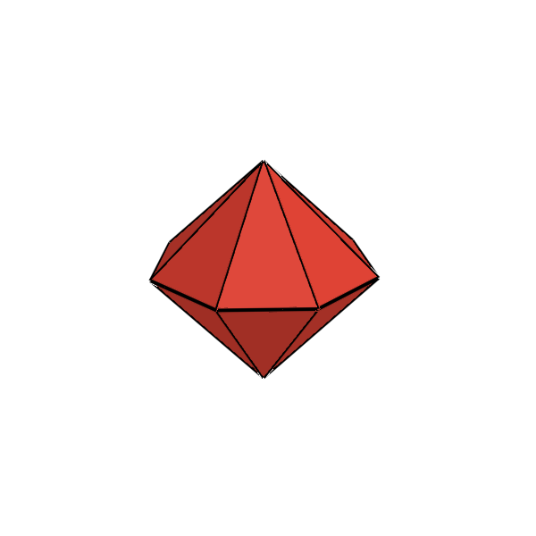 | Two $n$-gonal pyramids joined base-to-base along an equatorial regular $n$-gon, consisting of $2n$ congruent isosceles triangles. | Exactly 1 type:<br>• $2n$ triangles | Catalan duals of prisms; all $n+2$ vertices lie symmetrically on the unit sphere. | Classical infinite dual series ($n=4$ specializes to the regular octahedron). |
| **The Trapezohedral Phylum** | 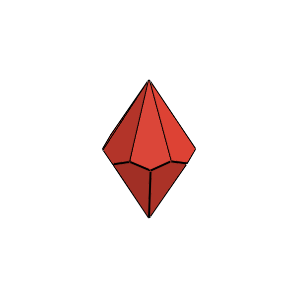 | Catalan duals of $n$-gonal antiprisms, consisting of $2n$ congruent kites (deltoids) arranged in an offset staggered equatorial belt. | Exactly 1 type:<br>• $2n$ kites (deltoids) | All $2n+2$ vertices lie symmetrically on the circumscribed unit sphere. | Classical infinite dual series ($n=3$ specializes to the trigonal trapezohedron / rhombohedron). |

#### 1-Variable Studded / Augmented Phyla
| Phylum | Heptagonal ($n=7$) Exemplar | Generative Rule & Structure | Polygon Count & Breakdown | Spherical Anchor Status | Exclusion Rationale |
| :--- | :---: | :--- | :--- | :--- | :--- |
| **Equatorially Studded Prisms** | 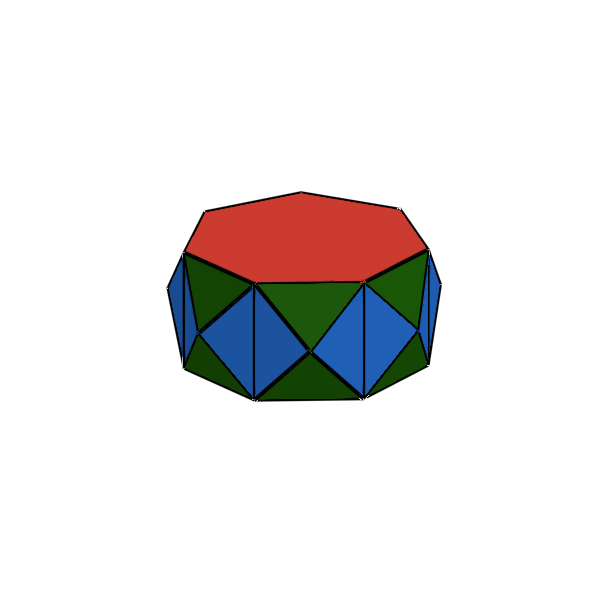 | An $n$-gonal prism whose lateral $n$ quadrilateral faces are studded with pyramids or creased into 4 triangles. | Exactly 2 types:<br>• 2 $n$-gons<br>• $4n$ triangles | All $2n + n$ vertices normalize onto the circumscribed sphere. | Infinite family of augmented prisms. |
| **Equatorially Studded Antiprisms** | 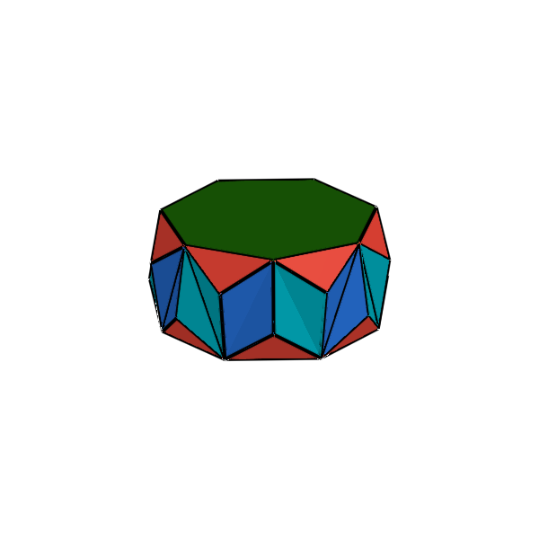 | An $n$-gonal antiprism whose $2n$ lateral triangular faces are studded with pyramids or creased into 3 triangles. | Exactly 2 types:<br>• 2 $n$-gons<br>• $6n$ triangles | All $2n + 2n$ vertices normalize onto the circumscribed sphere. | Infinite family of augmented antiprisms. |
| **Equatorially Studded Elongated Bipyramids** | 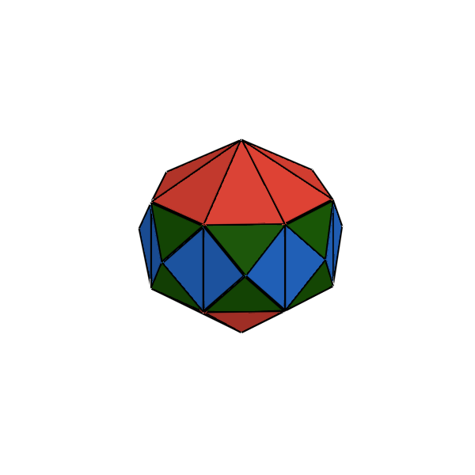 | An $n$-gonal bipyramid with an inserted prismatic band whose lateral square faces are studded with pyramids. | Exactly 1 or 2 types:<br>• $2n$ polar triangles<br>• $4n$ equatorial triangles | All $2n + 2 + n$ vertices normalize symmetrically onto the unit sphere. | Infinite family of elongated bipyramid derivatives. |
| **Studded Gyroelongated Bipyramids** | 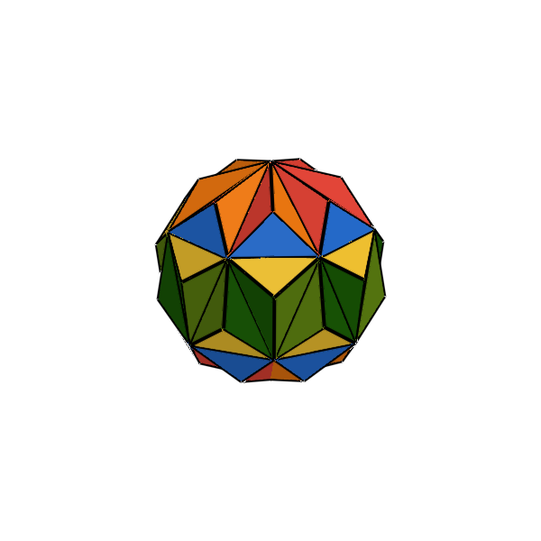 | An $n$-gonal bipyramid with an inserted antiprismatic belt whose $2n$ lateral triangles and/or polar caps are studded with pyramids. | Exactly 1 or 2 types:<br>• $2n$ polar triangles<br>• $6n$ equatorial triangles | All $2n + 2 + 2n$ vertices normalize onto the sphere. | Infinite family of gyroelongated bipyramid derivatives. |
| **Polar Studded Bipyramids** | 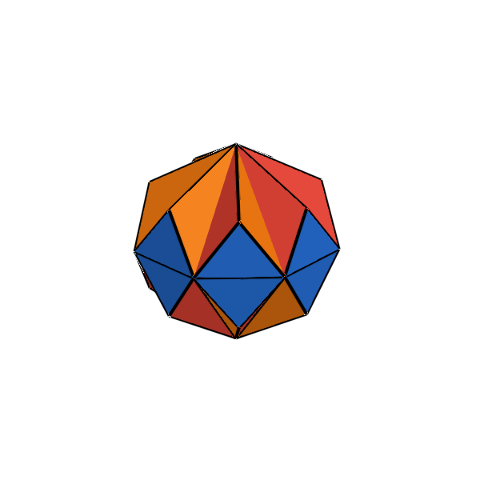 | An $n$-gonal bipyramid whose $2n$ triangular faces are all studded with pyramids (triakis bipyramids). | Exactly 1 type:<br>• $6n$ triangles | All $n + 2 + 2n$ vertices lie symmetrically on the unit sphere. | Infinite family of studded Catalan duals. |
| **Studded Trapezohedra** | 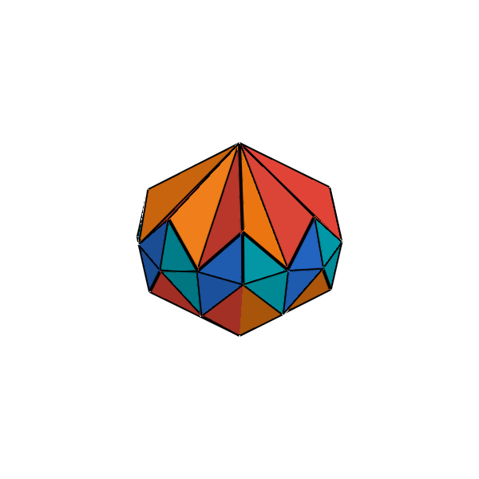 | An $n$-gonal trapezohedron whose $2n$ kite faces are each studded with a pyramid (creased into 4 triangles). | Exactly 1 or 2 types:<br>• $8n$ triangles | All $2n + 2 + 2n$ vertices lie on the sphere. | Infinite family of studded dual trapezohedra. |

#### 2-Variable Infinite Phyla: Geodesic Spheres & Goldberg Solids
Beyond 1-variable families parameterized only by $n$, there exist **2-variable infinite groups** parameterized independently by two integer variables $(m, n)$:

| Phylum | Exemplar | Generative Rule & Structure | Polygon Count & Breakdown | Spherical Anchor Status | Exclusion Rationale |
| :--- | :---: | :--- | :--- | :--- | :--- |
| **Geodesic Spheres $\{3, 5+\}_{m, n}$** |  | Higher-order spherical triangulations of the icosahedron parameterized by $(m, n)$ with $T = m^2 + mn + n^2$. | Exactly 1 type:<br>• $20T$ triangles (100% triangular faces) | By definition, all $10T + 2$ vertices are projected radially onto the unit sphere. | Infinite 2-variable family of spherical triangulations. |
| **Goldberg Solids $GP(m, n)$** | 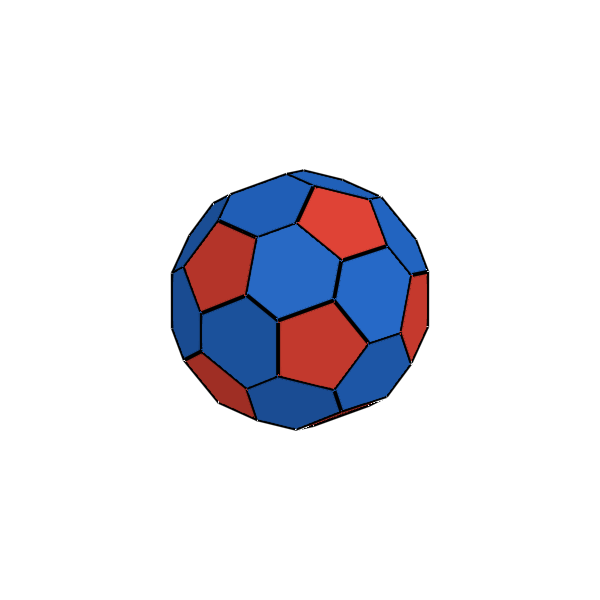 | Exact polar duals of geodesic spheres parameterized by $(m, n)$ with $T = m^2 + mn + n^2$. | Exactly 2 types:<br>• 12 pentagons<br>• $10(T-1)$ hexagons | All $20T$ vertices lie symmetrically on the unit sphere. | Infinite 2-variable family of dual polyhedra. |

---

### 5.2 Kepler-Poinsot Polyhedra & Non-Intersectional Axiom

A common point of inquiry is whether the 4 regular Kepler-Poinsot star polyhedra ($\{5, 5/2\}$, $\{5/2, 5\}$, $\{5/2, 3\}$, and $\{3, 5/2\}$) claim or belong to any Cookson regimes.

* **Explicitly Not "Solids"**: Mathematically, the Kepler-Poinsot polyhedra are **polyhedra, not solids**. Because their faces and edges self-intersect and pass through one another, they enclose multiple overlapping interior chambers rather than defining a single solid boundary.
* **Strict Disqualification under Axiom 5 (No Self-Intersection)**: Under Axiom 5 of the Sieve, faces and edges may not cross or pass through one another. By their fundamental definition, all Kepler-Poinsot polyhedra consist of large regular polygons or star pentagrams whose planes intersect and pass through the interior of the polyhedron. Consequently, **no Kepler-Poinsot polyhedron can claim a Cookson regime**.
* **The "Optical Illusion" of Solidification**: To the casual eye, a star polyhedron might appear as a concave outer boundary shell with protruding star pyramids and valley folds. If one were to "solidify" that visual silhouette—chopping away the internal self-intersecting geometry—the resulting non-self-intersecting outer boundary *could* potentially satisfy the Sieve and claim a Cookson regime.
* **Why Solidification Destroys the Kepler-Poinsot Identity**: This distinction is not mere pedantry. Solidification fundamentally replaces the entire mathematical graph:
  1. **Face Level**: A true regular pentagram $\{5/2\}$ has **exactly 5 vertices and 5 intersecting edges, not 10**. Solidifying a pentagram in 2D converts it into a 10-vertex decagram star boundary (5 outer tips + 5 inner intersection vertices) with 5 separate outer triangles surrounding a central pentagon.
  2. **Polyhedral Level**: In 3D, solidifying a Kepler-Poinsot polyhedron creates dozens of new intersection vertices where the planes cross, generates new boundary edges along all intersection lines, and fractures each original large face (such as the 20 equilateral triangles of the Great Icosahedron or the 12 pentagrams of the Great Stellated Dodecahedron) into multiple smaller disjoint polygonal pieces.
  
  Because its vertices, edges, and faces have been completely replaced with an entirely different combinatorial structure, the resulting solidified outer boundary **is NOT a Kepler-Poinsot polyhedron**.

---

## 6. The Official Cookson Sequence ($H_1 - H_8$)

> [!NOTE]
> **Provisional Indexing & Completeness Note**: 
> - **Provisional Numbering**: The current **$H_\#$ designations are working, provisional indices**. The authors are actively in the middle of exploring, classifying, and unravelling the underlying mathematical patterns and overarching taxonomic families of these topological regimes. As structural patterns are formalized, these assignments may be reorganized into a more comprehensive, systematic family hierarchy.
> - **Completeness**: This roster of 8 known Cookson Solid regimes ($H_1 \dots H_8$) **has not been proven to be complete**. Additional valid topological regimes that satisfy the Core Axioms (The Sieve) and pass the Taxonomic Exclusion rules may yet be discovered.

These are the 8 currently known Cookson solids, passing all regime rules and possessing either an entirely unique topological graph or a concave profile that distinguishes them from classical planar geometry:

| Index | Preview | Official Name | Classification | Suffix Form | Parent Catalan Solid | Classical Graph | Vertices ($V$) | Faces ($F$) | Face Breakdown |
| :---: | :---: | :--- | :--- | :--- | :--- | :--- | :---: | :---: | :--- |
| **$H_1$** | 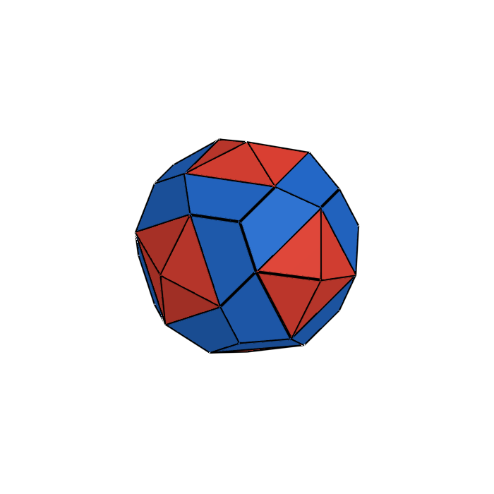 | **Gyrotrapezotrigonal Octasphere** | Convex Irregular | `-sphere` | Pentagonal Icositetrahedron | *Unique* | 38 | 48 | 24 Trapezoids, 24 Triangles |
| **$H_2$** | 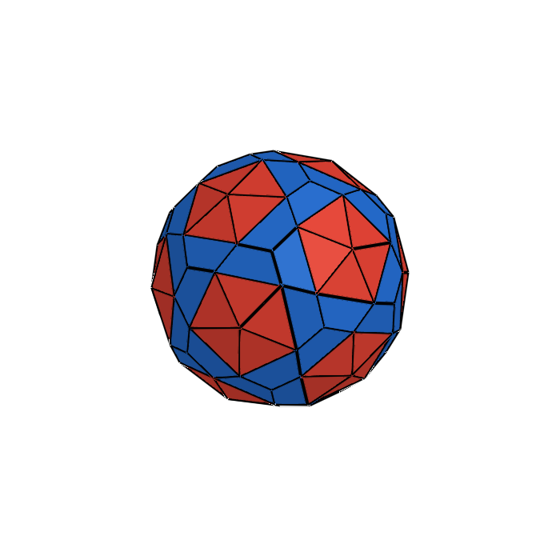 | **Gyrotrapezotrigonal Icosasphere** | Convex Irregular | `-sphere` | Pentagonal Hexecontahedron | *Unique* | 92 | 120 | 60 Trapezoids, 60 Triangles |
| **$H_3$** | 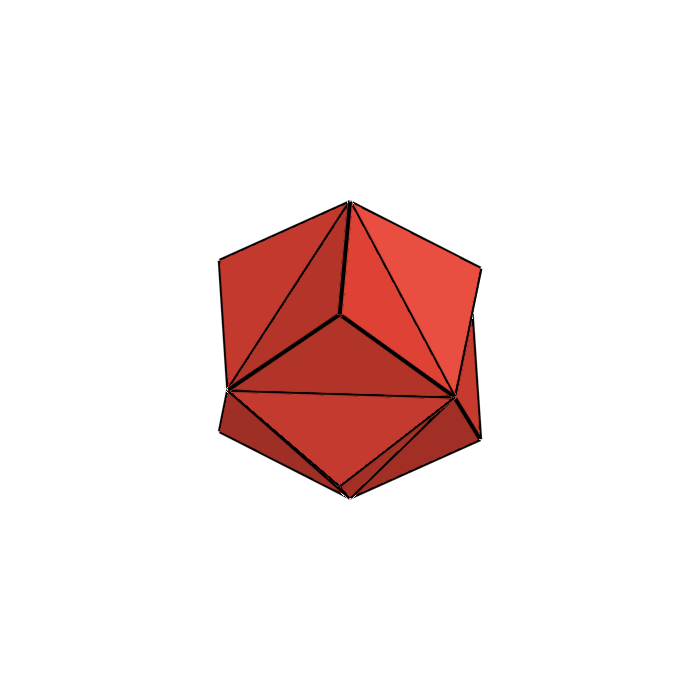 | **Studded Octahedron** | Concave Shadow | `-hedron` | Rhombic Dodecahedron | *Triakis Octahedron* | 14 | 24 | 24 Triangles |
| **$H_4$** | 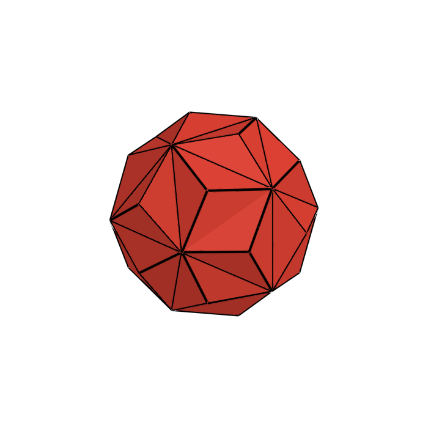 | **Studded Icosahedron** | Concave Shadow | `-hedron` | Rhombic Triacontahedron | *Triakis Icosahedron* | 32 | 60 | 60 Triangles |
| **$H_5$** | 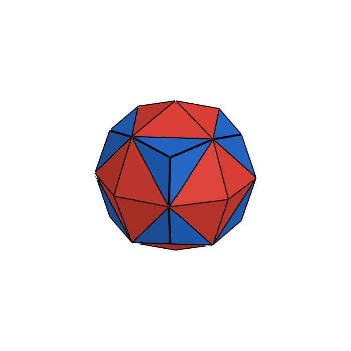 | **Studded Cuboctahedron** | Concave Shadow | `-hedron` | Deltoidal Icositetrahedron | *Disdyakis Cuboctahedron* | 26 | 48 | 48 Triangles (Chiral pairs) |
| **$H_6$** |  | **Studded Rhombic Triacontasphere** | Concave Shadow | `-sphere` | Deltoidal Hexecontahedron | *Disdyakis Rhombic Triacontahedron* | 62 | 120 | 120 Triangles (Chiral pairs) |
| **$H_7$** | 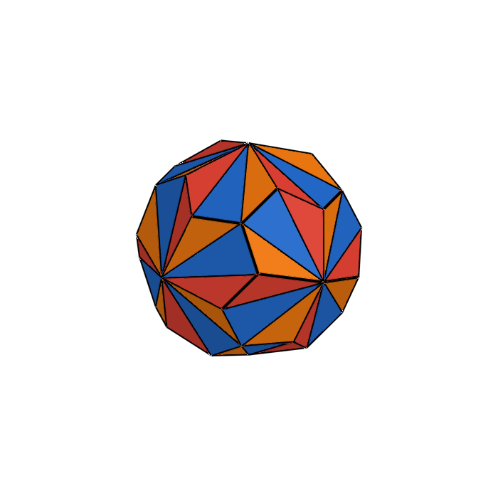 | **Gyrobitrigonal Octasphere** | Concave Irregular | `-sphere` | Pentagonal Icositetrahedron | *Unique* | 38 | 72 | 24 Isosceles, 48 Scalene Triangles |
| **$H_8$** | 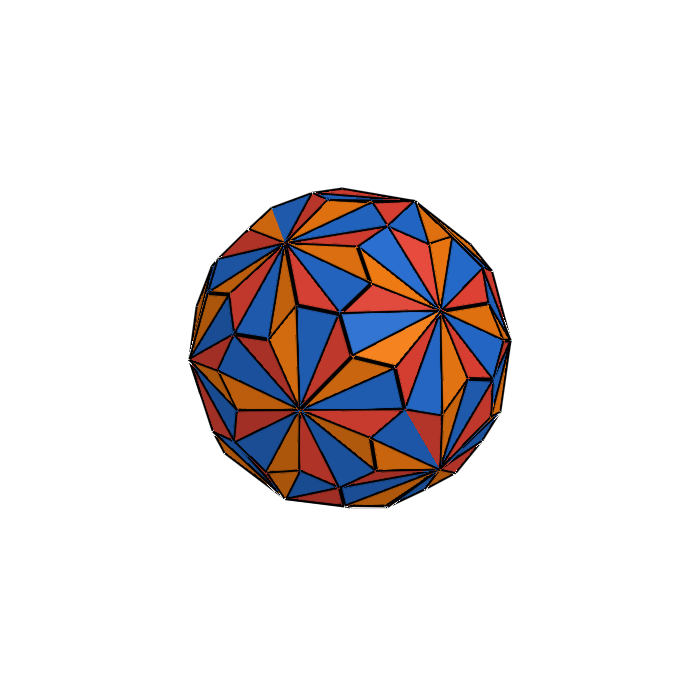 | **Gyrobitrigonal Icosasphere** | Concave Irregular | `-sphere` | Pentagonal Hexecontahedron | *Unique* | 92 | 180 | 60 Isosceles, 120 Scalene Triangles |

---

## 7. Group Breakdowns

### The Convex Irregulars (Unique Graphs)
* **$H_1$: Gyrotrapezotrigonal Octasphere**: Art's original convex Pentagonal Icositetrahedron derivative ($V=38, F=48$).
* **$H_2$: Gyrotrapezotrigonal Icosasphere**: Art's original convex Pentagonal Hexecontahedron derivative ($V=92, F=120$).

### The Concave Shadows (Classical Graphs, Different Convexity)
* **$H_3$: Studded Octahedron**: Concave valley-fold derivative of the Rhombic Dodecahedron ($V=14, F=24$; classical graph: *Triakis Octahedron*). Suffix `-hedron` because it was not forcibly normalized from an octahedron.
* **$H_4$: Studded Icosahedron**: Concave valley-fold derivative of the Rhombic Triacontahedron ($V=32, F=60$; classical graph: *Triakis Icosahedron*). Suffix `-hedron` because it was not forcibly normalized from an icosahedron.
* **$H_5$: Studded Cuboctahedron**: Concave valley-fold derivative of the Deltoidal Icositetrahedron ($V=26, F=48$; classical graph: *Disdyakis Cuboctahedron*). Suffix `-hedron` because it was not forcibly normalized from a cuboctahedron.
* **$H_6$: Studded Rhombic Triacontasphere**: Concave valley-fold derivative of the Deltoidal Hexecontahedron ($V=62, F=120$; classical graph: *Disdyakis Rhombic Triacontahedron*). Suffix `-sphere` because it is normalized from the Rhombic Triacontahedron.

### The Concave Irregulars (Unique Graphs, Unique Convexity)
* **$H_7$: Gyrobitrigonal Octasphere**: Concave valley-fold derivative of the Pentagonal Icositetrahedron ($V=38, F=72$). Created by cutting each skew pentakite from the tip to the lower pair of vertices, fracturing it into 1 central isosceles triangle and 2 mirrored flanking scalene triangles.
* **$H_8$: Gyrobitrigonal Icosasphere**: Concave valley-fold derivative of the Pentagonal Hexecontahedron ($V=92, F=180$). Same 3-triangle pentakite cut applied to the icosahedral parent.

---

## 8. Julia API Usage

### Accessing Solids
```julia
using Unihedron

# By H-index symbol (:H1 to :H8) or integer (1 to 8)
h1 = cookson(:H1)   # H1: Gyrotrapezotrigonal Octasphere (Convex Irregular)
h3 = cookson(:H3)   # H3: Studded Octahedron (Concave Shadow)
h4 = cookson(:H4)   # H4: Studded Icosahedron (Concave Shadow)
h5 = cookson(:H5)   # H5: Studded Cuboctahedron (Concave Shadow)
h6 = cookson(:H6)   # H6: Studded Rhombic Triacontasphere (Concave Shadow)
h7 = cookson(:H7)   # H7: Gyrobitrigonal Octasphere (Concave Irregular)
h8 = cookson(:H8)   # H8: Gyrobitrigonal Icosasphere (Concave Irregular)

# By official constructor names
P1 = gyrotrapezotrigonal_octasphere()
P3 = studded_octahedron()
P4 = studded_icosahedron()
P5 = studded_cuboctahedron()
P6 = studded_rhombic_triacontasphere()
P7 = gyrobitrigonal_octasphere()

# Accessing the Excluded list (by :He1 - :He4 shorthand, integer 1-4, or name)
ex1 = excluded_cookson(:He1)                     # Studded Hexasphere
ex3 = cookson(:He3)                              # Studded Rhombic Dodecasphere
ex_names = excluded_cookson_names()
ex_name2 = excluded_cookson_name(2)              # "Studded Dodecasphere"

# Structural metadata query
info = cookson_info(:H3)
println(info.name)             # "Studded Octahedron"
println(info.group)            # "Concave Shadow"
println(info.classical_graph)  # "Triakis Octahedron"
println(info.parent_catalan)   # "Rhombic Dodecahedron"
```
