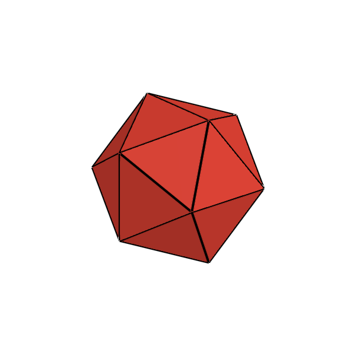
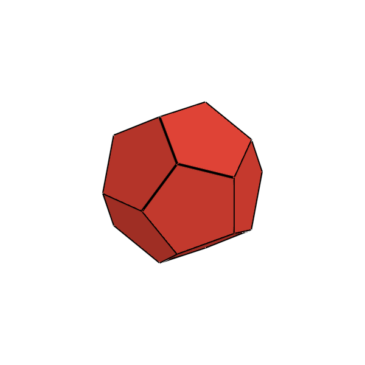
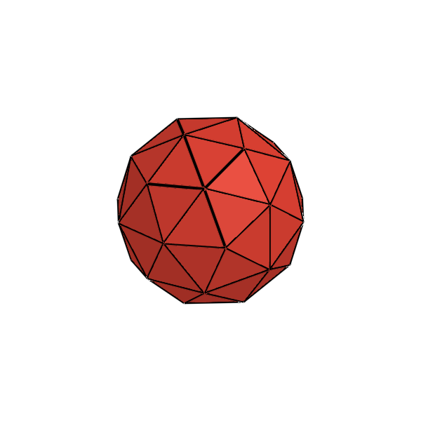
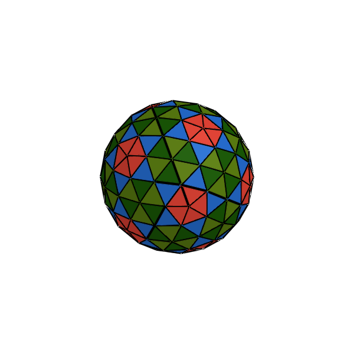
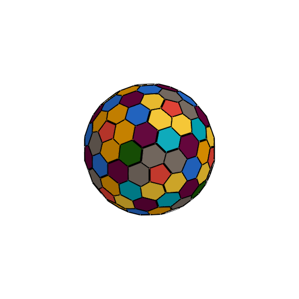

# Geodesic Spheres & Goldberg Solids (2-Variable Infinite Groups)

**Formalized by the American architect and systems theorist R. Buckminster Fuller (1895–1983), the British mathematician H. S. M. Coxeter (1907–2003), and the American mathematician Michael Goldberg (1902–1990) in his 1937 paper *A Class of Multi-Symmetric Polyhedra*.**

---

## 1. The 2-Variable Infinite Group $\{3, 5+\}_{m, n}$ & $GP(m, n)$

Most infinite polyhedral phyla (such as prisms, antiprisms, pyramids, bipyramids, and trapezohedra) are **1-variable infinite families** parameterized by a single integer $n \ge 3$ representing the rotational symmetry order of the equatorial base.

In contrast, **Geodesic Spheres** and **Goldberg Solids** form a **special class of 2-variable infinite groups** parameterized by two independent integers $(m, n)$ with $m \ge 1, n \ge 0$:

$$\text{Triangulation Number: } T = m^2 + mn + n^2$$

$$\text{Geodesic Sphere } \{3, 5+\}_{m, n}: \quad V = 10T + 2, \quad E = 30T, \quad F = 20T \quad \text{(100\% Triangular Faces)}$$

$$\text{Goldberg Solid } GP(m, n): \quad V = 20T, \quad E = 30T, \quad F = 10T + 2 \quad \text{(12 Pentagons} + 10(T-1) \text{ Hexagons)}$$

Because both $m$ and $n$ can be independently chosen, this 2-variable parameter space generates an infinite two-dimensional grid of distinct topological polyhedral graphs.

---

## 2. The Three Fundamental Breakdown Classes

Coxeter and Fuller classified all geodesic spherical subdivisions into three fundamental geometric classes based on the $(m, n)$ parameter vector:

```
                          (0, 0)
                          /    \
                     (1, 0)----(0, 1)        Class I:   (m, 0) [along edge]
                     /    \    /    \        Class II:  (m, m) [along median, 30°]
                (2, 0)----(1, 1)----(0, 2)   Class III: (m, n) [chiral skew]
```

### 1. Class I: Alternate Subdivisions $\{3, 5+\}_{m, 0}$ & $GP(m, 0)$ ($n = 0, T = m^2$)
* **Subdivision Path**: The subdivision lines are drawn **parallel to the original edges** of the icosahedron, connecting nearest-neighbor lattice points.
* **Symmetry**: Retains the full mirror symmetry ($I_h$) of the regular icosahedron.
* **Examples**:
  - $(1, 0)$: Regular Icosahedron ($V=12, F=20$) $\to$ dual $GP(1, 0)$ Regular Dodecahedron ($V=20, F=12$).
  - $(2, 0)$: $2\nu$ Geodesic Sphere ($V=42, F=80$) $\to$ dual $GP(2, 0)$ ($V=80, F=42$: 12 pentagons, 30 hexagons).
  - $(3, 0)$: $3\nu$ Geodesic Sphere ($V=92, F=180$) $\to$ dual $GP(3, 0)$ ($V=180, F=92$: 12 pentagons, 80 hexagons).

### 2. Class II: Triacon Subdivisions $\{3, 5+\}_{m, m}$ & $GP(m, m)$ ($m = n, T = 3m^2$)
* **Subdivision Path**: The subdivision lines are drawn along the **medians to 1 level out "next-nearest neighbors"** (rotated by $30^\circ$ / perpendicular to original icosahedral edges).
* **Symmetry**: Fully achiral with preserved icosahedral symmetry ($I_h$).
* **Examples**:
  - $(1, 1)$: Geodesic Sphere $\{3, 5+\}_{1, 1}$ ($T=3, V=32, F=60$). Its dual is $GP(1, 1)$—the classical **Truncated Icosahedron** ($C_{60}$ Buckminsterfullerene) with $V=60, F=32$ (12 pentagons and 20 hexagons).
  - $(2, 2)$: Geodesic Sphere $\{3, 5+\}_{2, 2}$ ($T=12, V=122, F=240$). Its dual is $GP(2, 2)$ ($V=240, F=122$: 12 pentagons and 110 hexagons).

### 3. Class III: Skew / Chiral Subdivisions $\{3, 5+\}_{m, n}$ & $GP(m, n)$ ($m \ne n, m, n > 0, T = m^2 + mn + n^2$)
* **Subdivision Path**: The triangular grid is **gyrated into a chiral form** at a skew angle $\theta = \arctan\left(\frac{n\sqrt{3}}{2m+n}\right)$.
* **Chirality**: Lacks reflection planes and exhibits pure rotational icosahedral symmetry ($I$). Each $(m, n)$ exists as an enantiomorphic pair of left-handed $(m, n)$ and right-handed $(n, m)$ twins.
* **Examples**:
  - $(2, 1)$: Chiral Geodesic Sphere $\{3, 5+\}_{2, 1}$ ($T=7, V=72, F=140$). Its dual is the chiral Goldberg Solid $GP(2, 1)$ ($V=140, F=72$: 12 pentagons and 60 hexagons).
  - $(3, 1)$: Chiral Geodesic Sphere $\{3, 5+\}_{3, 1}$ ($T=13, V=132, F=260$). Its dual is the chiral Goldberg Solid $GP(3, 1)$ ($V=260, F=132$: 12 pentagons and 120 hexagons).

---

## 3. The 2-Variable Geodesic & Goldberg Series Table

| Class | Parameters $(m, n)$ | $T$ | Preview (Geodesic) | Geodesic Sphere ($100\%$ Triangles) | Preview (Goldberg) | Dual Goldberg Solid ($12$ Pentagons + Hexagons) |
| :---: | :---: | :---: | :---: | :--- | :---: | :--- |
| **Class I** | **$(1, 0)$** | $1$ |  | **$\{3, 5+\}_{1, 0}$** ($V=12, F=20$) |  | **$GP(1, 0)$ Regular Dodecahedron** ($V=20, F=12$) |
| **Class I** | **$(2, 0)$** | $4$ |  | **$\{3, 5+\}_{2, 0}$** ($V=42, F=80$) |  | **$GP(2, 0)$ Goldberg Solid** ($V=80, F=42$) |
| **Class II** | **$(1, 1)$** | $3$ |  | **$\{3, 5+\}_{1, 1}$** ($V=32, F=60$) |  | **$GP(1, 1)$ Truncated Icosahedron ($C_{60}$)** ($V=60, F=32$) |
| **Class II** | **$(2, 2)$** | $12$ |  | **$\{3, 5+\}_{2, 2}$** ($V=122, F=240$) |  | **$GP(2, 2)$ Goldberg Solid** ($V=240, F=122$) |

---

## 4. Julia API Usage

```julia
using Unihedron

# 1. Class I Geodesic Spheres & Goldberg Solids (n = 0)
g10  = geodesic_sphere(1, 0)   # Regular Icosahedron (V=12, F=20)
g20  = geodesic_sphere(2, 0)   # 2v Geodesic Sphere (V=42, F=80)
gb20 = goldberg_solid(2, 0)    # GP(2, 0): V=80, F=42 (12 pentagons, 30 hexagons)

# 2. Class II Geodesic Spheres & Goldberg Solids (m = n)
g11  = geodesic_sphere(1, 1)   # Class II (1, 1): V=32, F=60
gb11 = goldberg_solid(1, 1)    # GP(1, 1) Truncated Icosahedron / C60 (V=60, F=32)

g22  = geodesic_sphere(2, 2)   # Class II (2, 2): V=122, F=240
gb22 = goldberg_solid(2, 2)    # GP(2, 2): V=240, F=122 (12 pentagons, 110 hexagons)
```
