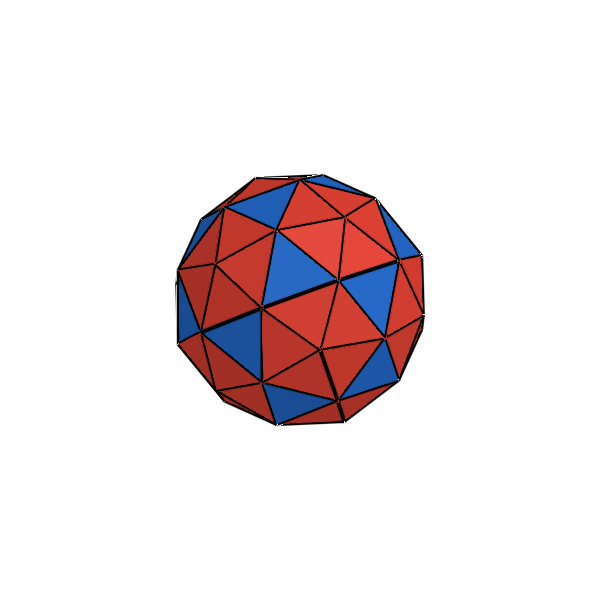
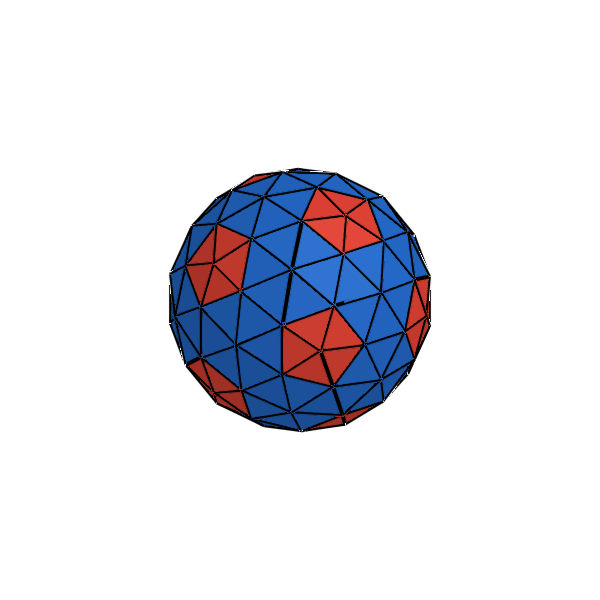
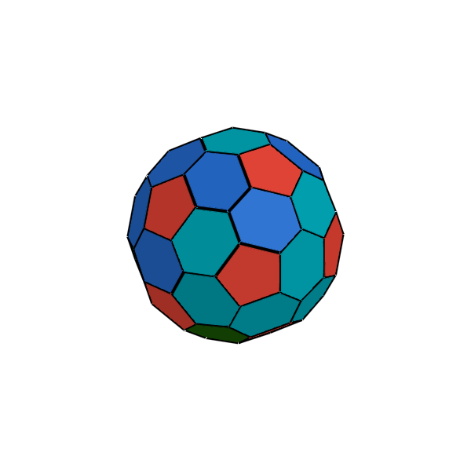
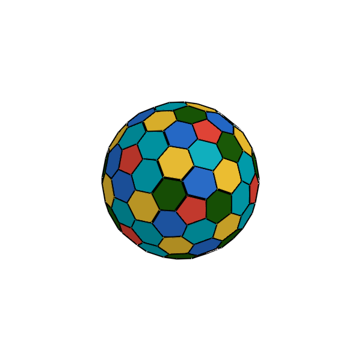

# Geodesic Spheres & Goldberg Solids

**Formalized by the American architect and systems theorist R. Buckminster Fuller (1895–1983) and the American mathematician Michael Goldberg (1902–1990) in his 1937 paper *A Class of Multi-Symmetric Polyhedra*.**

---

## 1. Historical & Mathematical Context

* **Geodesic Spheres**: Buckminster Fuller patented and popularized the **geodesic dome** (1954), triangulating spherical surfaces by subdividing the 20 faces of a regular icosahedron into smaller triangular networks and projecting the vertices onto the unit sphere. **Every geodesic sphere is made entirely of triangular faces.** The subdivision frequency is denoted by $\nu$ (or $T$).
* **Goldberg Solids**: Michael Goldberg (1937) classified the exact polar duals of geodesic icosahedra, denoted $GP(m, n)$. Goldberg proved that **every Goldberg solid contains exactly 12 regular pentagons** (at the 12 original vertices of the dual icosahedron) and a variable number of hexagons ($10(T-1)$ hexagons).

---

## 2. Defining Axioms & Rules

To qualify as a Geodesic Sphere or Goldberg Solid, the mesh must satisfy the following generative rules:

1. **Icosahedral Foundation**: Subdivided from the base symmetry of the regular icosahedron ($I_h$).
2. **Triangulation Subdivision (Frequency $\nu$)**: Each icosahedral triangular face is divided into $\nu^2$ smaller triangles.
3. **Spherical Normalization**: Every vertex $\mathbf{v}$ is projected radially onto the unit sphere: $\mathbf{v}_{\text{sphere}} = R \frac{\mathbf{v}}{\|\mathbf{v}\|}$.
4. **Dual Polyhedra (The 12-Pentagon Theorem)**: By Euler's formula ($\chi = 2$), any closed spherical mesh composed exclusively of pentagons and hexagons must contain **precisely 12 pentagons**, regardless of how many hundreds or thousands of hexagons surround them.

---

## 3. The Geodesic & Goldberg Series Table

| Frequency ($\nu$) / Type | Preview | Name | Vertices ($V$) | Edges ($E$) | Faces ($F$) | Face Breakdown | Dual Counterpart |
| :---: | :---: | :--- | :---: | :---: | :---: | :--- | :--- |
| **$\nu = 1$** |  | **$1\nu$ Geodesic Sphere** (Regular Icosahedron) | 12 | 30 | 20 | 20 Equilateral Triangles | Regular Dodecahedron ($GP(1,0)$) |
| **$\nu = 2$** |  | **$2\nu$ Geodesic Sphere** | 42 | 120 | 80 | 80 Spherical Triangles | $GP(2,0)$ Goldberg Solid |
| **$\nu = 3$** |  | **$3\nu$ Geodesic Sphere** | 92 | 270 | 180 | 180 Spherical Triangles | $GP(3,0)$ Goldberg Solid |
| **Dual $\nu = 2$** |  | **$GP(2,0)$ Goldberg Solid** | 80 | 120 | 42 | 12 Pentagons, 30 Hexagons | $2\nu$ Geodesic Sphere |
| **Dual $\nu = 3$** |  | **$GP(3,0)$ Goldberg Solid** | 180 | 270 | 92 | 12 Pentagons, 80 Hexagons | $3\nu$ Geodesic Sphere |

---

## 4. Julia API Usage

```julia
using Unihedron

# Geodesic Spheres (all faces are triangles)
g1 = geodesic_sphere(1; radius=1.0)  # Regular icosahedron (V=12, F=20)
g2 = geodesic_sphere(2; radius=1.0)  # 2v geodesic sphere (V=42, F=80)
g3 = geodesic_sphere(3; radius=1.0)  # 3v geodesic sphere (V=92, F=180)

# Goldberg Solids (exact duals: 12 pentagons, rest hexagons)
gb2 = goldberg_solid(2; radius=1.0)   # GP(2,0): V=80, F=42 (12 pentagons, 30 hexagons)
gb3 = goldberg_solid(3; radius=1.0)   # GP(3,0): V=180, F=92 (12 pentagons, 80 hexagons)
```
