# The Johnson Solids (Strictly Convex Non-Uniform Polyhedra with Regular Faces)

**Named after the American mathematician Norman Johnson (1930–2017), who listed and conjectured the complete set of 92 solids in 1966. The completeness was proven in 1969 by the Russian mathematician Victor Zalgaller.**

---

## 1. Historical & Mathematical Context

In 1966, **Norman Johnson** published his landmark paper *Convex Polyhedra with Regular Faces*, identifying 92 strictly convex polyhedra whose faces are all regular polygons, but which are not uniform (neither Platonic, Archimedean, prisms, nor antiprisms).

Johnson conjectured that his list of 92 solids was complete. In 1969, **Victor Zalgaller** confirmed the conjecture using an exhaustive computer-assisted geometric exhaustion proof, establishing that **no 93rd Johnson solid exists**.

The 92 Johnson solids are partitioned into several structural families based on their generative operations (attaching pyramids, cupolae, or rotundae, elongating with prisms, or gyroelongating with antiprisms), culminating in the **eight elementary Johnson solids ($J_{84} - J_{92}$)**, which cannot be created by slicing or augmenting Platonic or Archimedean parents.

---

## 2. Defining Axioms & Rules

To qualify as a Johnson solid, a polyhedron must satisfy all of the following rules:

1. **Regular Faces**: Every face is a strictly regular polygon (equilateral triangles, squares, pentagons, hexagons, octagons, or decagons).
2. **Strict Convexity**: Every dihedral angle between adjacent faces is strictly convex ($ < 180^\circ$). If two adjacent faces were coplanar ($180^\circ$), they would merge into a non-regular polygon.
3. **Non-Uniformity**: The solid is not vertex-transitive (isogonal), excluding the Platonic and Archimedean solids.
4. **Non-Prismatic Exclusion**: The infinite uniform families of $n$-gonal prisms and $n$-gonal antiprisms are excluded.

---

## 3. The Complete 92 Johnson Solids Table

| Index | Preview | Name | Vertices ($V$) | Edges ($E$) | Faces ($F$) | Face Breakdown |
| :---: | :---: | :--- | :---: | :---: | :---: | :--- |
| **$J_{1}$** | 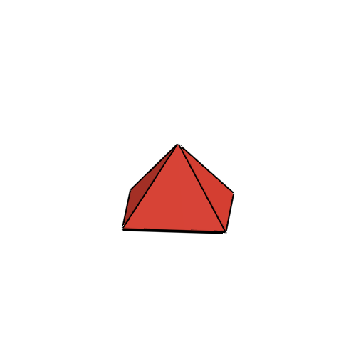 | **Square Pyramid** | 5 | 8 | 5 | 4 Triangles, 1 Square |
| **$J_{2}$** | 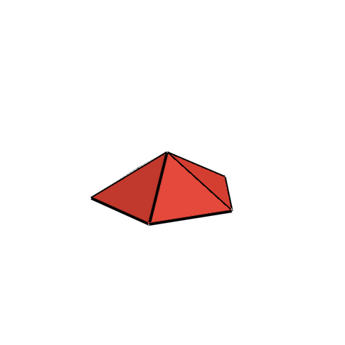 | **Pentagonal Pyramid** | 6 | 10 | 6 | 5 Triangles, 1 Pentagon |
| **$J_{3}$** | 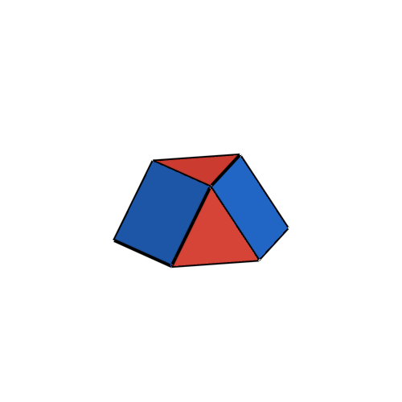 | **Triangular Cupola** | 9 | 15 | 8 | 4 Triangles, 3 Squares, 1 Hexagon |
| **$J_{4}$** | 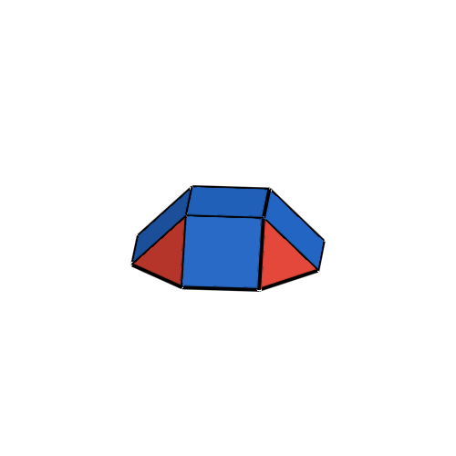 | **Square Cupola** | 12 | 20 | 10 | 4 Triangles, 5 Squares, 1 Octagon |
| **$J_{5}$** | 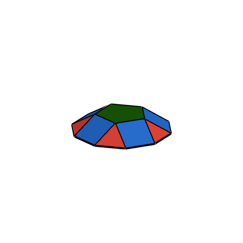 | **Pentagonal Cupola** | 15 | 25 | 12 | 5 Triangles, 5 Squares, 1 Pentagon, 1 Decagon |
| **$J_{6}$** | 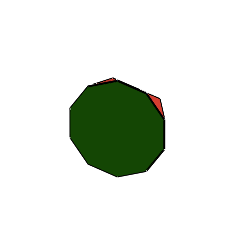 | **Pentagonal Rotunda** | 20 | 35 | 17 | 10 Triangles, 6 Pentagons, 1 Decagon |
| **$J_{7}$** | 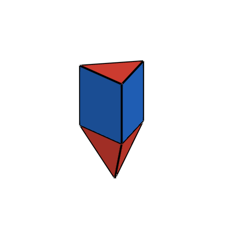 | **Elongated Triangular Pyramid** | 7 | 12 | 7 | 4 Triangles, 3 Squares |
| **$J_{8}$** | 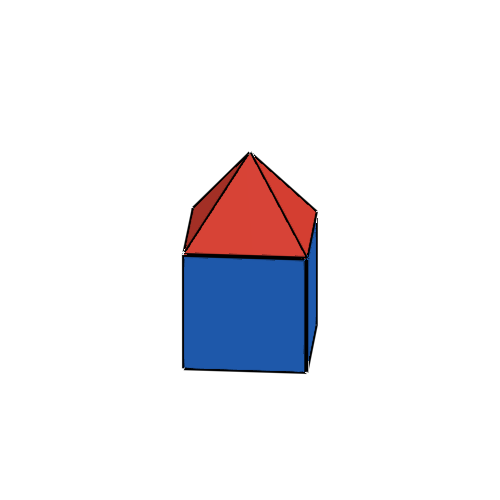 | **Elongated Square Pyramid** | 9 | 16 | 9 | 4 Triangles, 5 Squares |
| **$J_{9}$** | 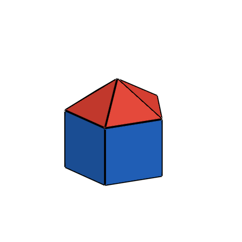 | **Elongated Pentagonal Pyramid** | 11 | 20 | 11 | 5 Triangles, 5 Squares, 1 Pentagon |
| **$J_{10}$** | 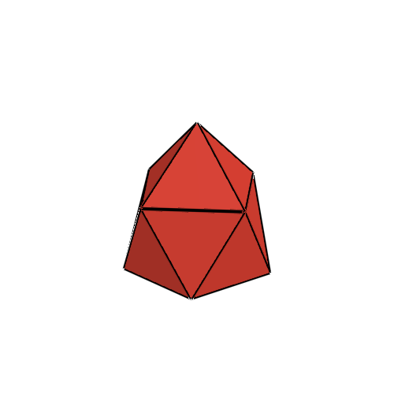 | **Gyroelongated Square Pyramid** | 9 | 20 | 13 | 12 Triangles, 1 Square |
| **$J_{11}$** | 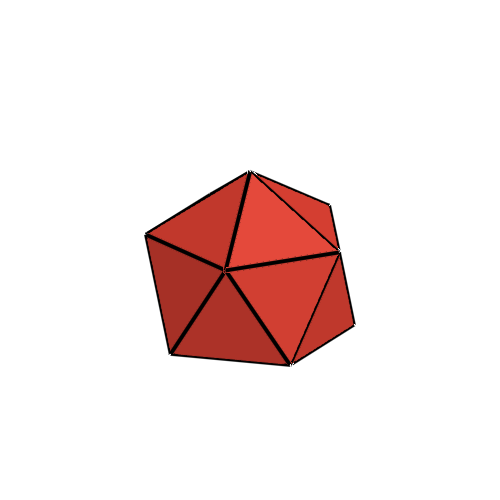 | **Gyroelongated Pentagonal Pyramid** | 11 | 25 | 16 | 15 Triangles, 1 Pentagon |
| **$J_{12}$** | 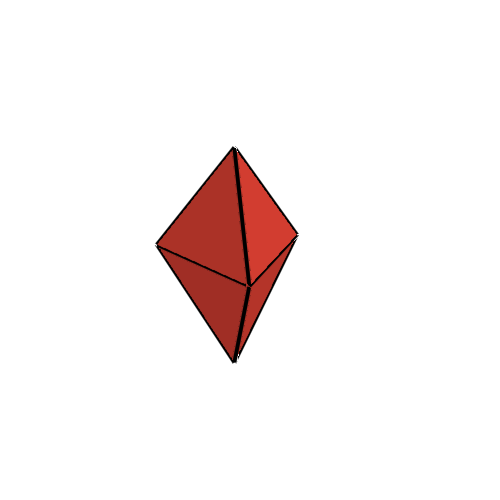 | **Triangular Bipyramid** | 5 | 9 | 6 | 6 Triangles |
| **$J_{13}$** | 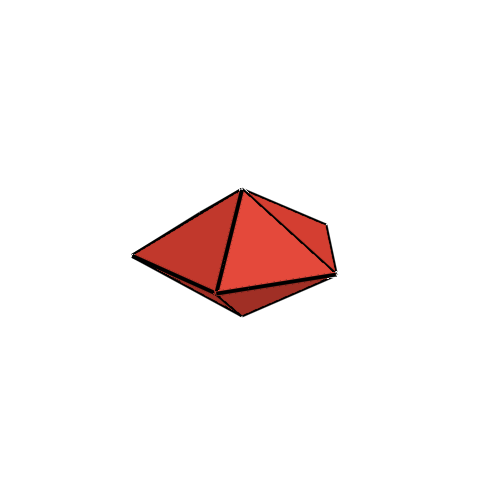 | **Pentagonal Bipyramid** | 7 | 15 | 10 | 10 Triangles |
| **$J_{14}$** | 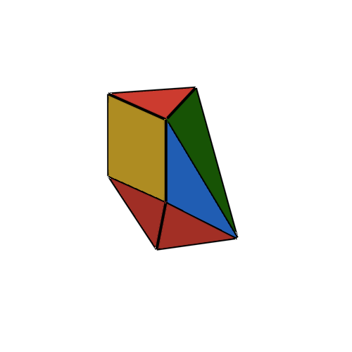 | **Elongated Triangular Bipyramid** | 8 | 16 | 10 | 8 Triangles, 2 Squares |
| **$J_{15}$** | 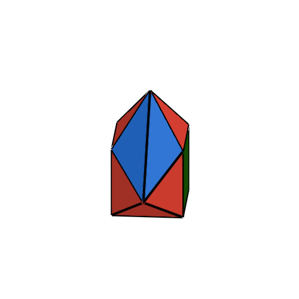 | **Elongated Square Bipyramid** | 10 | 20 | 12 | 8 Triangles, 4 Squares |
| **$J_{16}$** | 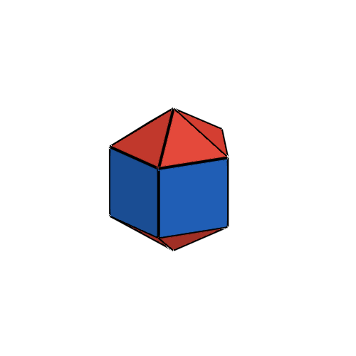 | **Elongated Pentagonal Bipyramid** | 12 | 25 | 15 | 10 Triangles, 5 Squares |
| **$J_{17}$** | 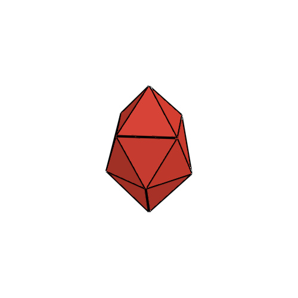 | **Gyroelongated Square Bipyramid** | 10 | 24 | 16 | 16 Triangles |
| **$J_{18}$** | 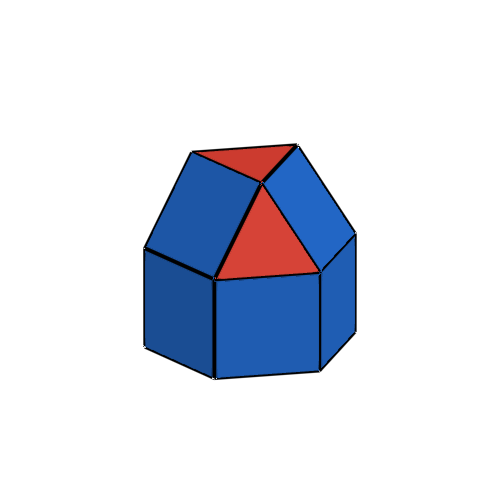 | **Elongated Triangular Cupola** | 15 | 27 | 14 | 4 Triangles, 9 Squares, 1 Hexagon |
| **$J_{19}$** | 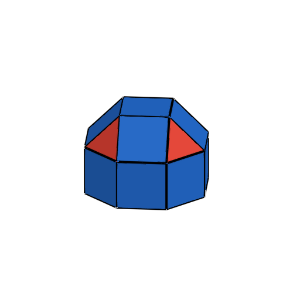 | **Elongated Square Cupola** | 20 | 36 | 18 | 4 Triangles, 13 Squares, 1 Octagon |
| **$J_{20}$** | 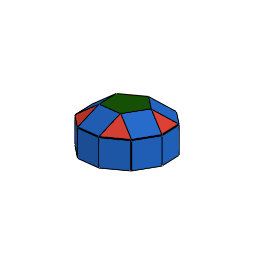 | **Elongated Pentagonal Cupola** | 25 | 45 | 22 | 5 Triangles, 15 Squares, 1 Pentagon, 1 Decagon |
| **$J_{21}$** | 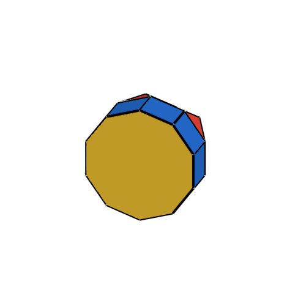 | **Elongated Pentagonal Rotunda** | 30 | 55 | 27 | 10 Triangles, 10 Squares, 6 Pentagons, 1 Decagon |
| **$J_{22}$** | 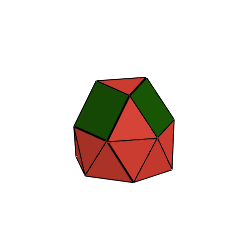 | **Gyroelongated Triangular Cupola** | 15 | 33 | 20 | 16 Triangles, 3 Squares, 1 Hexagon |
| **$J_{23}$** | 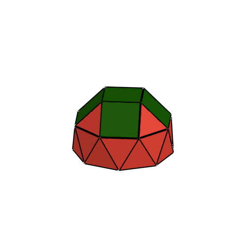 | **Gyroelongated Square Cupola** | 20 | 44 | 26 | 20 Triangles, 5 Squares, 1 Octagon |
| **$J_{24}$** | 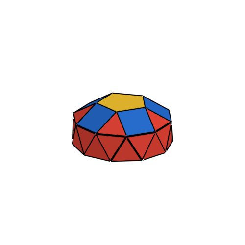 | **Gyroelongated Pentagonal Cupola** | 25 | 55 | 32 | 25 Triangles, 5 Squares, 1 Pentagon, 1 Decagon |
| **$J_{25}$** | 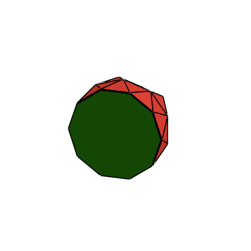 | **Gyroelongated Pentagonal Rotunda** | 30 | 65 | 37 | 30 Triangles, 6 Pentagons, 1 Decagon |
| **$J_{26}$** | 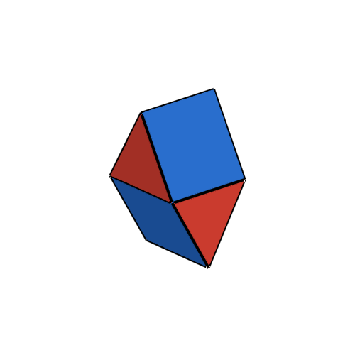 | **Gyrobifastigium** | 8 | 14 | 8 | 4 Triangles, 4 Squares |
| **$J_{27}$** | 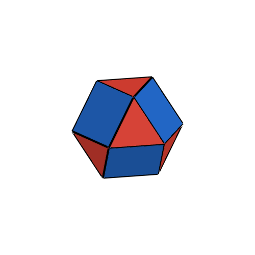 | **Triangular Orthobicupola** | 12 | 24 | 14 | 8 Triangles, 6 Squares |
| **$J_{28}$** | 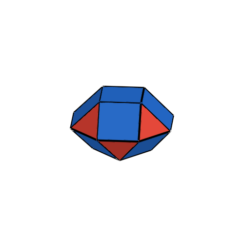 | **Square Orthobicupola** | 16 | 32 | 18 | 8 Triangles, 10 Squares |
| **$J_{29}$** | 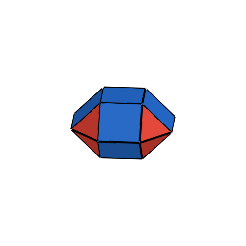 | **Square Gyrobicupola** | 16 | 32 | 18 | 8 Triangles, 10 Squares |
| **$J_{30}$** | 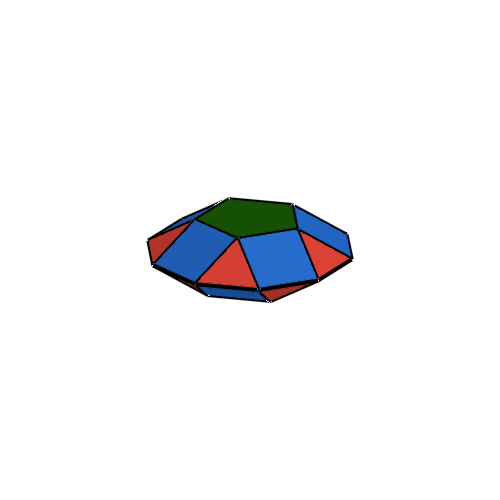 | **Pentagonal Orthobicupola** | 20 | 40 | 22 | 10 Triangles, 10 Squares, 2 Pentagons |
| **$J_{31}$** | 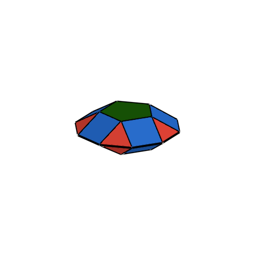 | **Pentagonal Gyrobicupola** | 20 | 40 | 22 | 10 Triangles, 10 Squares, 2 Pentagons |
| **$J_{32}$** | 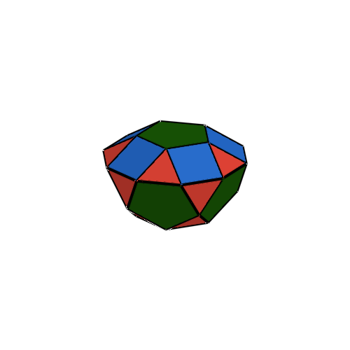 | **Pentagonal Orthocupolarotunda** | 25 | 50 | 27 | 15 Triangles, 5 Squares, 7 Pentagons |
| **$J_{33}$** | 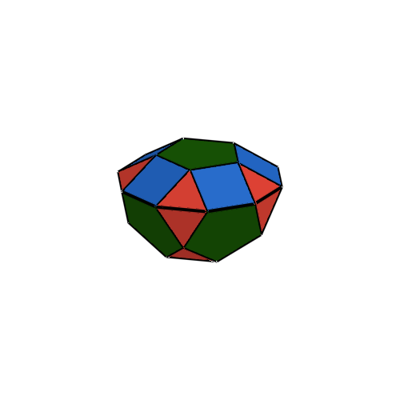 | **Pentagonal Gyrocupolarotunda** | 25 | 50 | 27 | 15 Triangles, 5 Squares, 7 Pentagons |
| **$J_{34}$** | 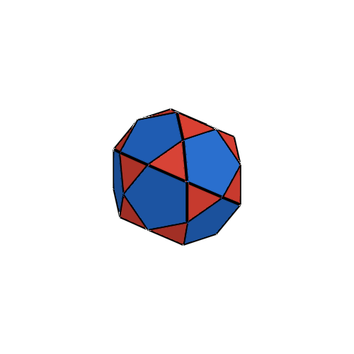 | **Pentagonal Orthobirotunda** | 30 | 60 | 32 | 20 Triangles, 12 Pentagons |
| **$J_{35}$** | 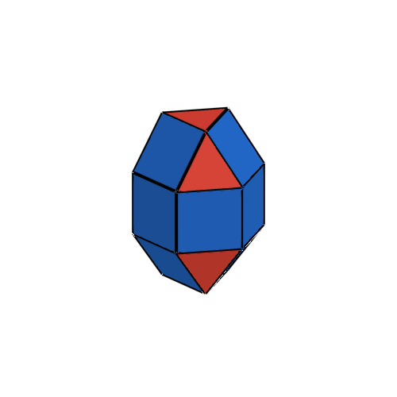 | **Elongated Triangular Orthobicupola** | 18 | 36 | 20 | 8 Triangles, 12 Squares |
| **$J_{36}$** | 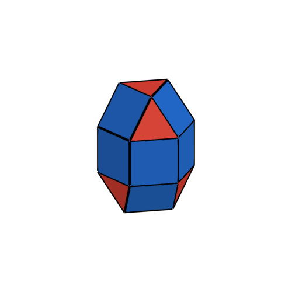 | **Elongated Triangular Gyrobicupola** | 18 | 36 | 20 | 8 Triangles, 12 Squares |
| **$J_{37}$** | 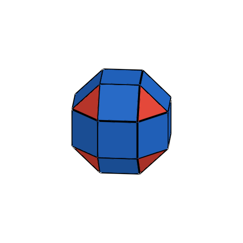 | **Elongated Square Gyrobicupola** | 24 | 48 | 26 | 8 Triangles, 18 Squares |
| **$J_{38}$** | 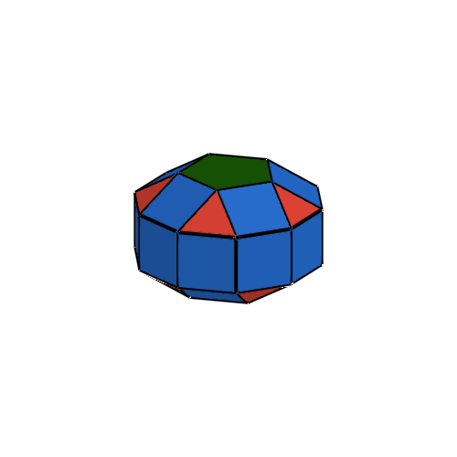 | **Elongated Pentagonal Orthobicupola** | 30 | 60 | 32 | 10 Triangles, 20 Squares, 2 Pentagons |
| **$J_{39}$** | 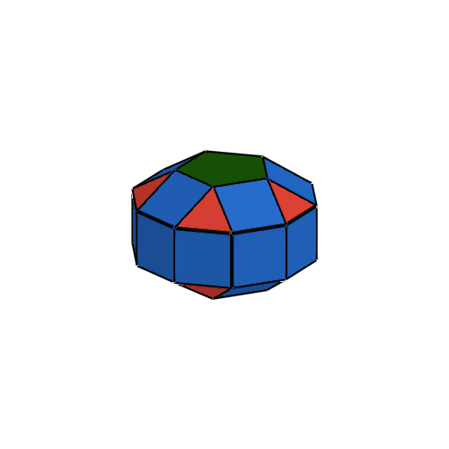 | **Elongated Pentagonal Gyrobicupola** | 30 | 60 | 32 | 10 Triangles, 20 Squares, 2 Pentagons |
| **$J_{40}$** | 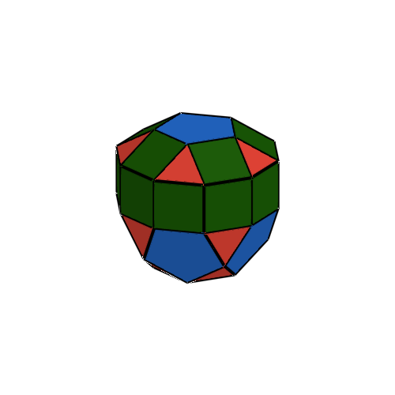 | **Elongated Pentagonal Orthocupolarotunda** | 35 | 70 | 37 | 15 Triangles, 15 Squares, 7 Pentagons |
| **$J_{41}$** | 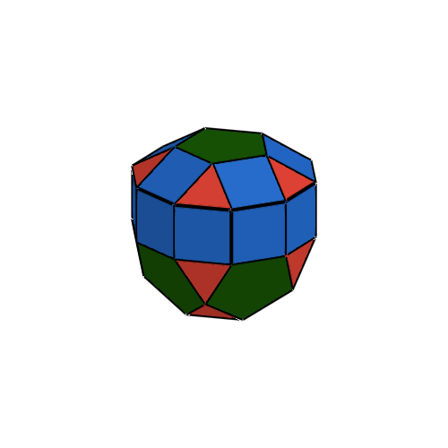 | **Elongated Pentagonal Gyrocupolarotunda** | 35 | 70 | 37 | 15 Triangles, 15 Squares, 7 Pentagons |
| **$J_{42}$** | 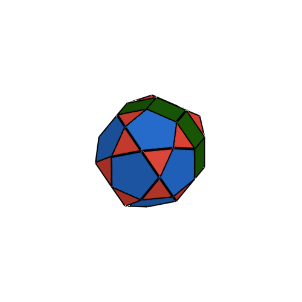 | **Elongated Pentagonal Orthobirotunda** | 40 | 80 | 42 | 20 Triangles, 10 Squares, 12 Pentagons |
| **$J_{43}$** | 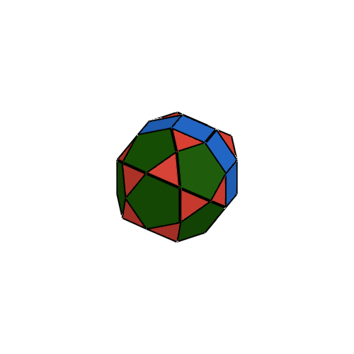 | **Elongated Pentagonal Gyrobirotunda** | 40 | 80 | 42 | 20 Triangles, 10 Squares, 12 Pentagons |
| **$J_{44}$** | 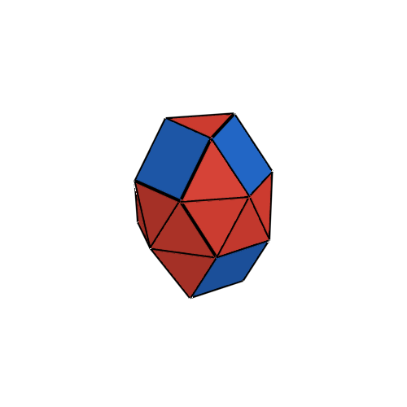 | **Gyroelongated Triangular Bicupola** | 18 | 42 | 26 | 20 Triangles, 6 Squares |
| **$J_{45}$** | 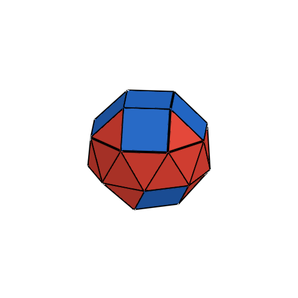 | **Gyroelongated Square Bicupola** | 24 | 56 | 34 | 24 Triangles, 10 Squares |
| **$J_{46}$** | 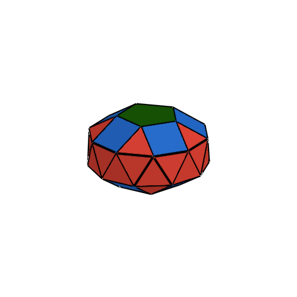 | **Gyroelongated Pentagonal Bicupola** | 30 | 70 | 42 | 30 Triangles, 10 Squares, 2 Pentagons |
| **$J_{47}$** | 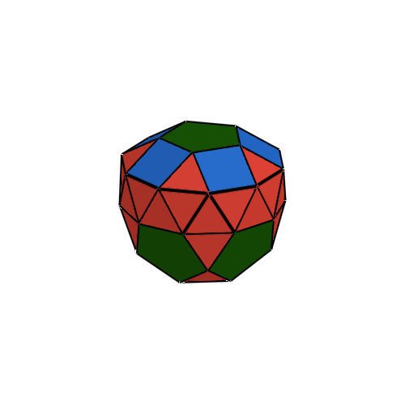 | **Gyroelongated Pentagonal Cupolarotunda** | 35 | 80 | 47 | 35 Triangles, 5 Squares, 7 Pentagons |
| **$J_{48}$** | 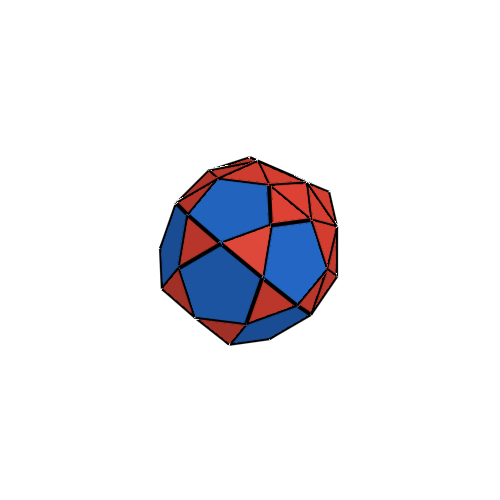 | **Gyroelongated Pentagonal Birotunda** | 40 | 90 | 52 | 40 Triangles, 12 Pentagons |
| **$J_{49}$** | 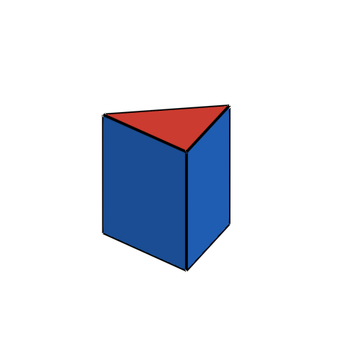 | **Augmented Triangular Prism** | 7 | 13 | 8 | 6 Triangles, 2 Squares |
| **$J_{50}$** | 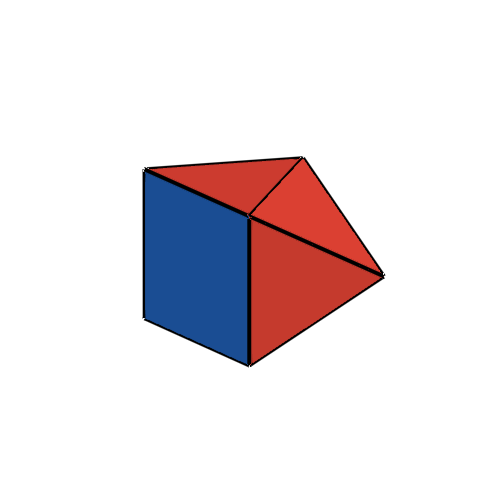 | **Biaugmented Triangular Prism** | 8 | 17 | 11 | 10 Triangles, 1 Square |
| **$J_{51}$** | 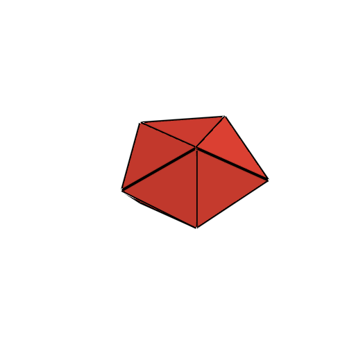 | **Triaugmented Triangular Prism** | 9 | 21 | 14 | 14 Triangles |
| **$J_{52}$** | 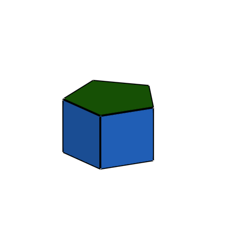 | **Augmented Pentagonal Prism** | 11 | 19 | 10 | 4 Triangles, 4 Squares, 2 Pentagons |
| **$J_{53}$** | 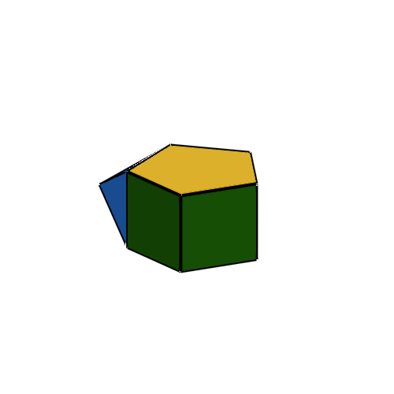 | **Biaugmented Pentagonal Prism** | 12 | 23 | 13 | 8 Triangles, 3 Squares, 2 Pentagons |
| **$J_{54}$** | 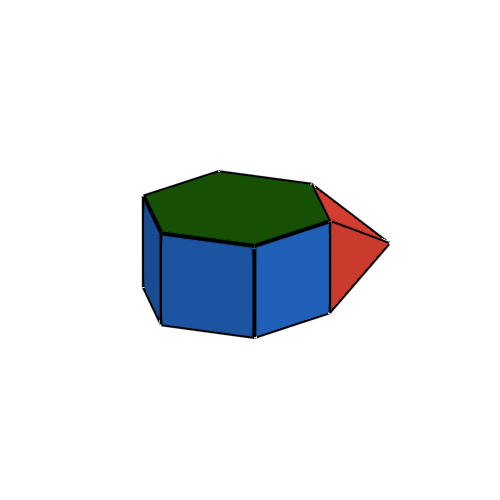 | **Augmented Hexagonal Prism** | 13 | 22 | 11 | 4 Triangles, 5 Squares, 2 Hexagons |
| **$J_{55}$** | 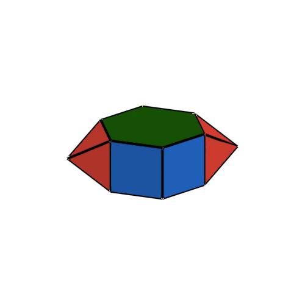 | **Parabiaugmented Hexagonal Prism** | 14 | 26 | 14 | 8 Triangles, 4 Squares, 2 Hexagons |
| **$J_{56}$** | 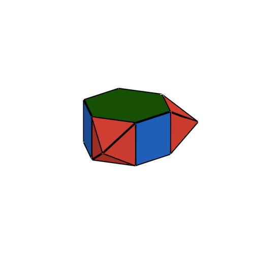 | **Metabiaugmented Hexagonal Prism** | 14 | 26 | 14 | 8 Triangles, 4 Squares, 2 Hexagons |
| **$J_{57}$** | 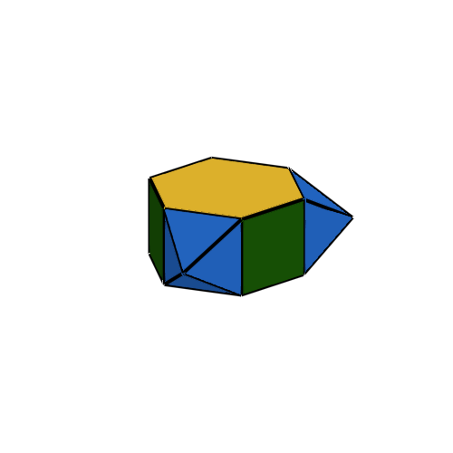 | **Triaugmented Hexagonal Prism** | 15 | 30 | 17 | 12 Triangles, 3 Squares, 2 Hexagons |
| **$J_{58}$** | 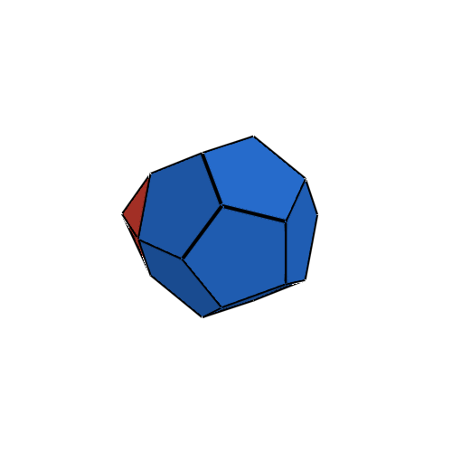 | **Augmented Dodecahedron** | 21 | 35 | 16 | 5 Triangles, 11 Pentagons |
| **$J_{59}$** | 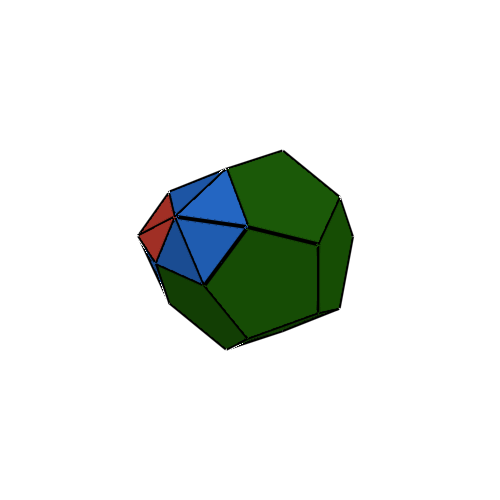 | **Parabiaugmented Dodecahedron** | 22 | 40 | 20 | 10 Triangles, 10 Pentagons |
| **$J_{60}$** | 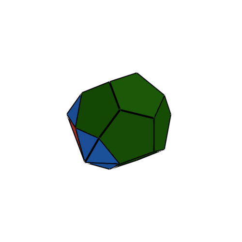 | **Metabiaugmented Dodecahedron** | 22 | 40 | 20 | 10 Triangles, 10 Pentagons |
| **$J_{61}$** | 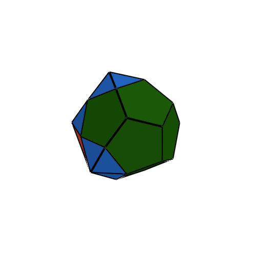 | **Triaugmented Dodecahedron** | 23 | 45 | 24 | 15 Triangles, 9 Pentagons |
| **$J_{62}$** | 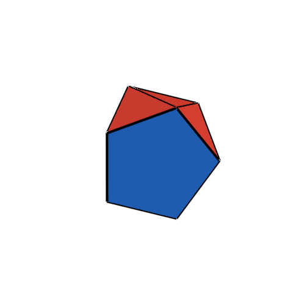 | **Metabidiminished Icosahedron** | 10 | 20 | 12 | 10 Triangles, 2 Pentagons |
| **$J_{63}$** | 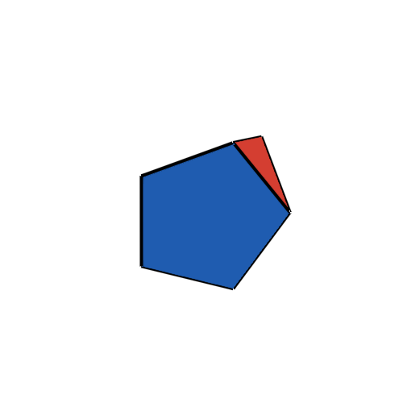 | **Tridiminished Icosahedron** | 9 | 17 | 10 | 7 Triangles, 2 Squares, 1 Pentagon |
| **$J_{64}$** | 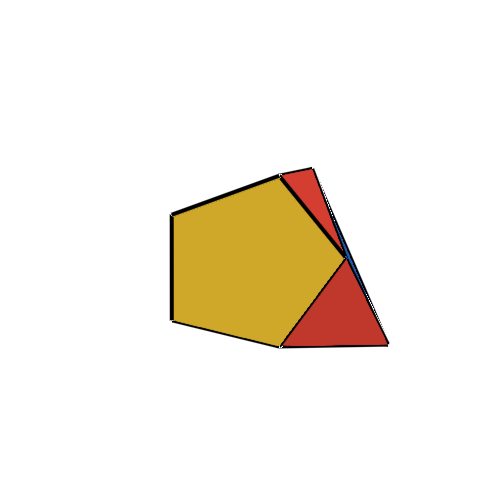 | **Augmented Tridiminished Icosahedron** | 10 | 20 | 12 | 9 Triangles, 2 Squares, 1 Pentagon |
| **$J_{65}$** | 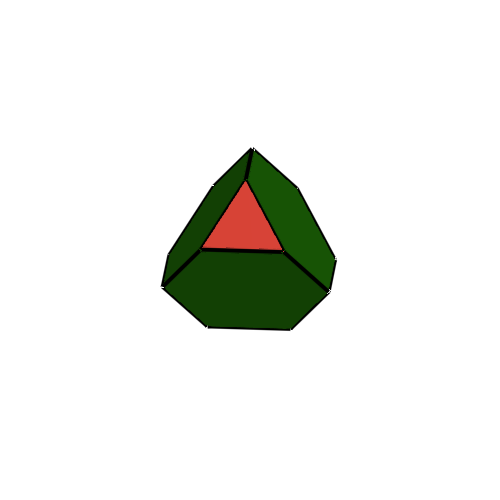 | **Augmented Truncated Tetrahedron** | 15 | 27 | 14 | 8 Triangles, 3 Squares, 3 Hexagons |
| **$J_{66}$** | 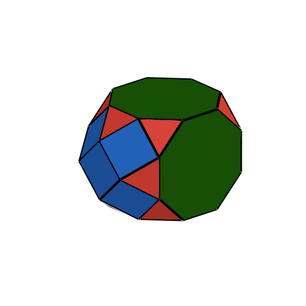 | **Augmented Truncated Cube** | 28 | 48 | 22 | 12 Triangles, 5 Squares, 5 Octagons |
| **$J_{67}$** | 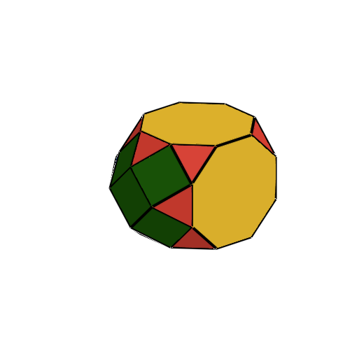 | **Biaugmented Truncated Cube** | 32 | 60 | 30 | 16 Triangles, 10 Squares, 4 Octagons |
| **$J_{68}$** | 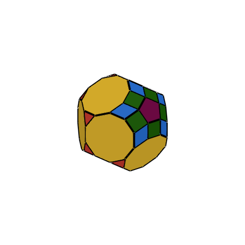 | **Augmented Truncated Dodecahedron** | 65 | 100 | 37 | 15 Triangles, 10 Squares, 1 Pentagon, 11 Decagons |
| **$J_{69}$** | 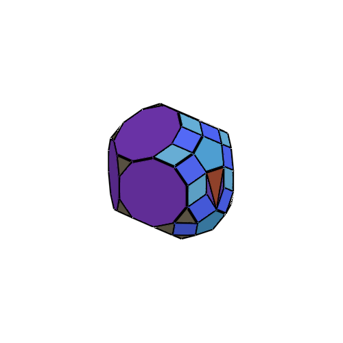 | **Parabiaugmented Truncated Dodecahedron** | 70 | 116 | 48 | 22 Triangles, 14 Squares, 2 Pentagons, 10 Decagons |
| **$J_{70}$** | 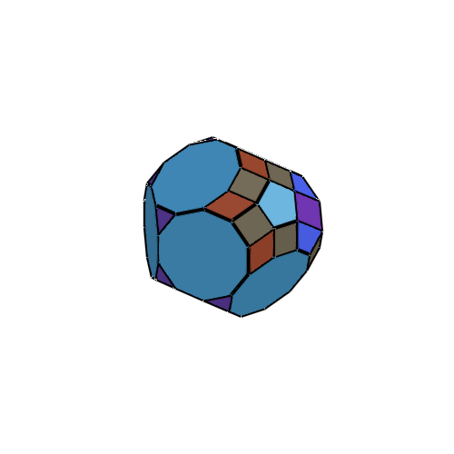 | **Metabiaugmented Truncated Dodecahedron** | 68 | 107 | 41 | 12 Triangles, 17 Squares, 2 Pentagons, 10 Decagons |
| **$J_{71}$** | 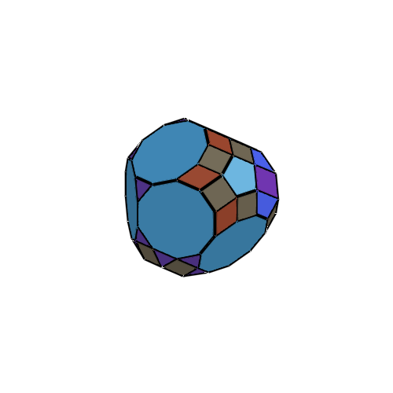 | **Triaugmented Truncated Dodecahedron** | 73 | 122 | 51 | 17 Triangles, 22 Squares, 3 Pentagons, 9 Decagons |
| **$J_{72}$** | 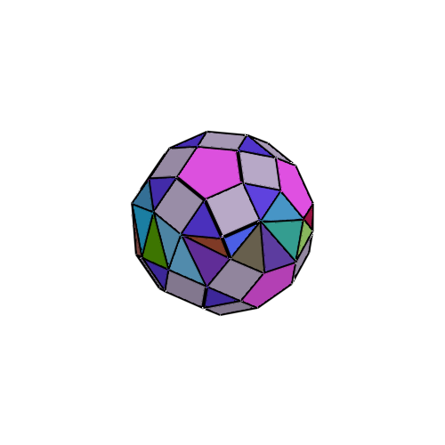 | **Gyrate Rhombicosidodecahedron** | 60 | 136 | 78 | 48 Triangles, 22 Squares, 8 Pentagons |
| **$J_{73}$** | 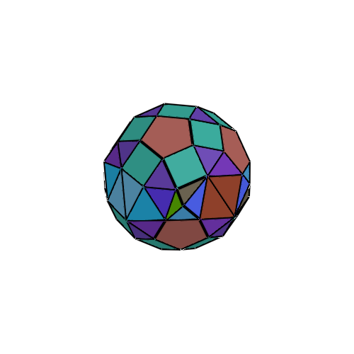 | **Parabigyrate Rhombicosidodecahedron** | 60 | 140 | 82 | 56 Triangles, 18 Squares, 8 Pentagons |
| **$J_{74}$** | 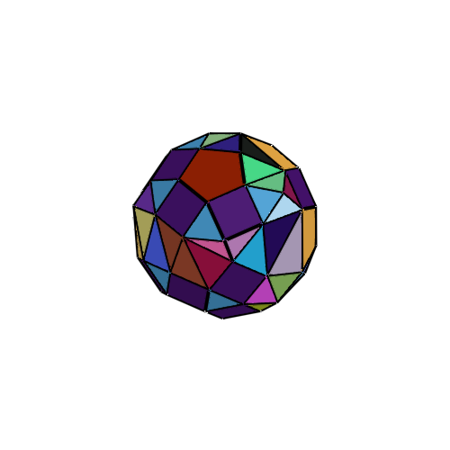 | **Metabigyrate Rhombicosidodecahedron** | 60 | 148 | 90 | 68 Triangles, 18 Squares, 4 Pentagons |
| **$J_{75}$** | 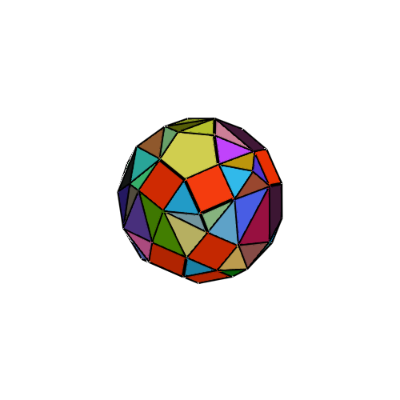 | **Trigyrate Rhombicosidodecahedron** | 60 | 155 | 97 | 80 Triangles, 15 Squares, 2 Pentagons |
| **$J_{76}$** | 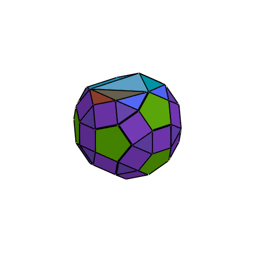 | **Diminished Rhombicosidodecahedron** | 55 | 114 | 61 | 25 Triangles, 27 Squares, 9 Pentagons |
| **$J_{77}$** | 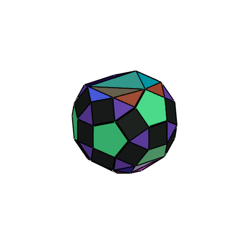 | **Paragyrate Diminished Rhombicosidodecahedron** | 55 | 123 | 70 | 40 Triangles, 24 Squares, 6 Pentagons |
| **$J_{78}$** | 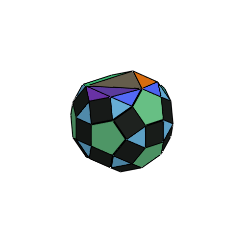 | **Metagyrate Diminished Rhombicosidodecahedron** | 55 | 122 | 69 | 39 Triangles, 23 Squares, 7 Pentagons |
| **$J_{79}$** | 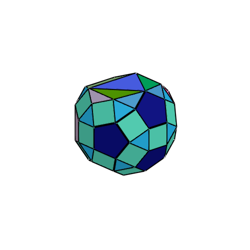 | **Bigyrate Diminished Rhombicosidodecahedron** | 55 | 130 | 77 | 53 Triangles, 19 Squares, 5 Pentagons |
| **$J_{80}$** | 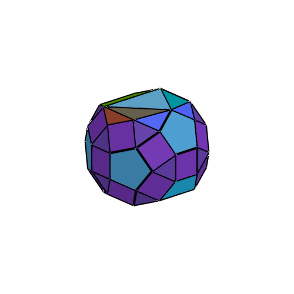 | **Parabidiminished Rhombicosidodecahedron** | 50 | 108 | 60 | 30 Triangles, 24 Squares, 6 Pentagons |
| **$J_{81}$** | 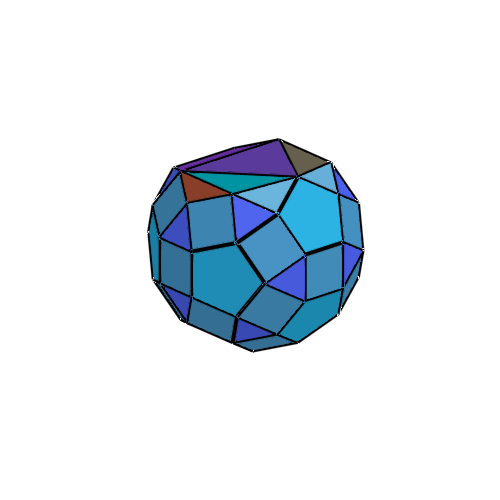 | **Metabidiminished Rhombicosidodecahedron** | 50 | 107 | 59 | 29 Triangles, 23 Squares, 7 Pentagons |
| **$J_{82}$** | 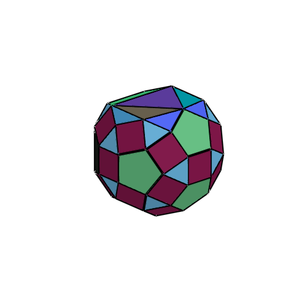 | **Gyrate Bidiminished Rhombicosidodecahedron** | 50 | 115 | 67 | 43 Triangles, 19 Squares, 5 Pentagons |
| **$J_{83}$** | 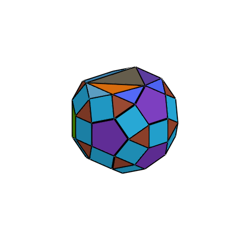 | **Tridiminished Rhombicosidodecahedron** | 45 | 100 | 57 | 33 Triangles, 19 Squares, 5 Pentagons |
| **$J_{84}$** | 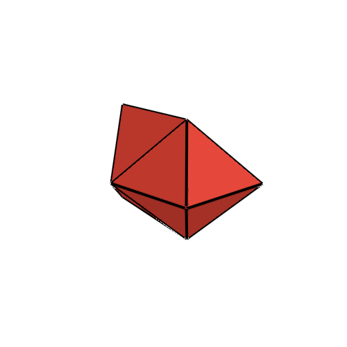 | **Snub Disphenoid** | 8 | 18 | 12 | 12 Triangles |
| **$J_{85}$** | 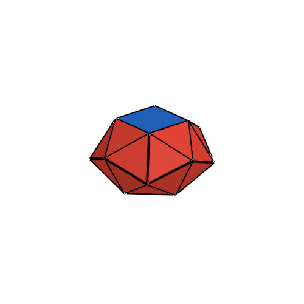 | **Snub Square Antiprism** | 16 | 40 | 26 | 24 Triangles, 2 Squares |
| **$J_{86}$** | 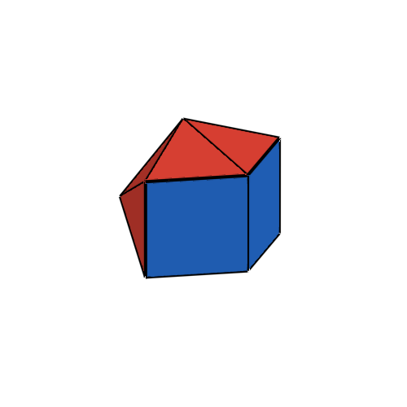 | **Sphenocorona** | 10 | 22 | 14 | 12 Triangles, 2 Squares |
| **$J_{87}$** | 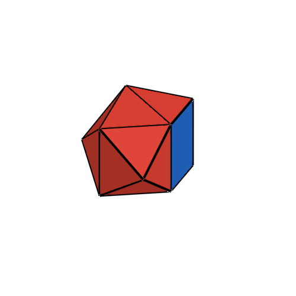 | **Augmented Sphenocorona** | 11 | 26 | 17 | 16 Triangles, 1 Square |
| **$J_{88}$** | 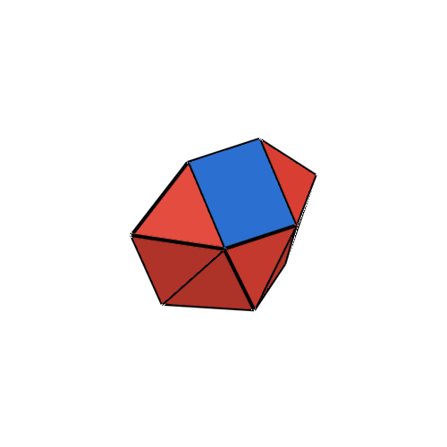 | **Sphenomegacorona** | 12 | 28 | 18 | 16 Triangles, 2 Squares |
| **$J_{89}$** | 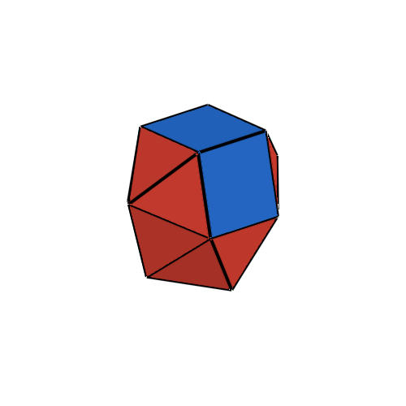 | **Hebesphenomegacorona** | 14 | 33 | 21 | 18 Triangles, 3 Squares |
| **$J_{90}$** | 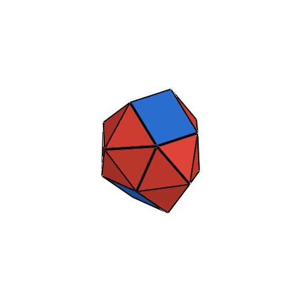 | **Disphenocingulum** | 16 | 38 | 24 | 20 Triangles, 4 Squares |
| **$J_{91}$** | 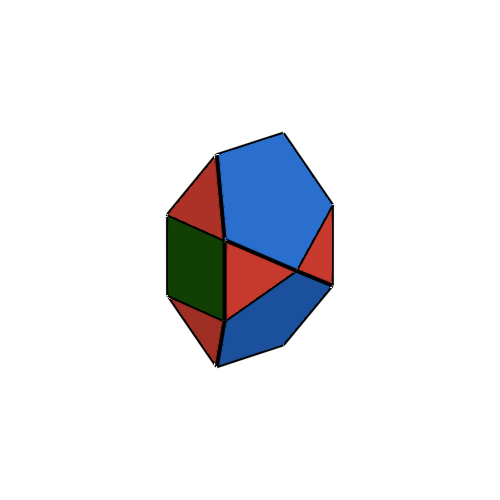 | **Bilunabirotunda** | 14 | 26 | 14 | 8 Triangles, 2 Squares, 4 Pentagons |
| **$J_{92}$** | 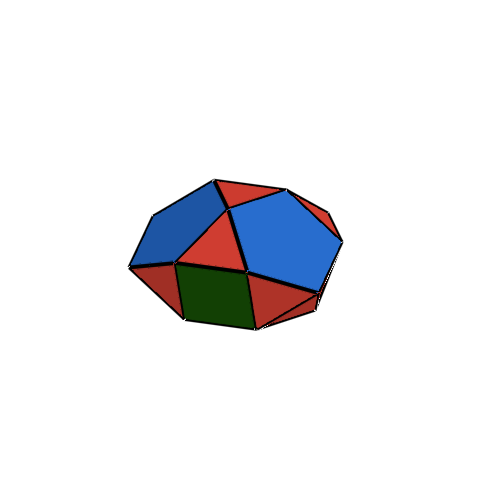 | **Triangular Hebesphenorotunda** | 18 | 36 | 20 | 13 Triangles, 3 Squares, 3 Pentagons, 1 Hexagon |
---

## 4. Julia API Usage

```julia
using Unihedron

# Access by dedicated constructor
pyr = square_pyramid()
cup = triangular_cupola()
gbf = gyrobifastigium()
sd  = snub_disphenoid()

# Access by index or symbol dispatcher (:J1 to :J92)
j1  = johnson(1)                 # Square pyramid (index 1 to 92)
j84 = johnson(:J84)              # Snub disphenoid
j90 = johnson(:bilunabirotunda)

# Query Johnson metadata & names
names = johnson_names()
println("Total Johnson Solids: ", length(names))  # 92
```
