# The Johnson Solids (Strictly Convex Non-Uniform Polyhedra with Regular Faces)

**Named after the American mathematician Norman Johnson (1930–2017), who listed and conjectured the complete set of 92 solids in 1966. The completeness was proven in 1969 by the Russian mathematician Victor Zalgaller.**

---

## 1. Historical & Mathematical Context

In 1966, **Norman Johnson** published his landmark paper *Convex Polyhedra with Regular Faces*, identifying 92 strictly convex polyhedra whose faces are all regular polygons, but which are not uniform (neither Platonic, Archimedean, prisms, nor antiprisms).

Johnson conjectured that his list of 92 solids was complete. In 1969, **Victor Zalgaller** confirmed the conjecture using an exhaustive computer-assisted geometric exhaustion proof, establishing that **no 93rd Johnson solid exists**.

The 92 Johnson solids are partitioned into several structural families based on their generative operations (attaching pyramids, cupolae, or rotundae, elongating with prisms, or gyroelongating with antiprisms), culminating in the **eight elementary Johnson solids ($J_{84} - J_{92}$)**, which cannot be created by slicing or augmenting Platonic or Archimedean parents.

---

## 2. Defining Axioms & Rules

To qualify as a Johnson solid, a polyhedron must satisfy all of the following rules:

1. **Regular Faces**: Every face is a strictly regular polygon (equilateral triangles, squares, pentagons, hexagons, octagons, or decagons).
2. **Strict Convexity**: Every dihedral angle between adjacent faces is strictly convex ($< 180^\circ$). If two adjacent faces were coplanar ($180^\circ$), they would merge into a non-regular polygon.
3. **Non-Uniformity**: The solid is not vertex-transitive (isogonal), excluding the Platonic and Archimedean solids.
4. **Non-Prismatic Exclusion**: The infinite uniform families of $n$-gonal prisms and $n$-gonal antiprisms are excluded.

---

## 3. Structural Families & Key Representatives

The 92 solids span six primary architectural classes:

1. **Pyramids, Cupolae, and Rotundae ($J_1 - J_6$)**: Elementary caps.
2. **Modified Pyramids & Bipyramids ($J_7 - J_{17}$)**: Elongated and gyroelongated pyramids and bipyramids.
3. **Modified Cupolae and Rotundae ($J_{18} - J_{48}$)**: Bicupolae, cupolarotundae, and birotundae.
4. **Augmented Prisms ($J_{49} - J_{57}$)**: Prisms with pyramids attached to square faces.
5. **Modified Platonic & Archimedean Solids ($J_{58} - J_{83}$)**: Augmented, diminished, and gyrated derivatives of dodecahedra, icosahedra, and rhombicosidodecahedra.
6. **The Elementary Johnson Solids ($J_{84} - J_{92}$)**: Unique, stand-alone polyhedra with no relation to classical uniform parents.

### Key Visual Representatives Table

| Index | Preview | Name | Structural Category | Vertices ($V$) | Edges ($E$) | Faces ($F$) | Face Breakdown |
| :---: | :---: | :--- | :--- | :---: | :---: | :---: | :--- |
| **$J_1$** | 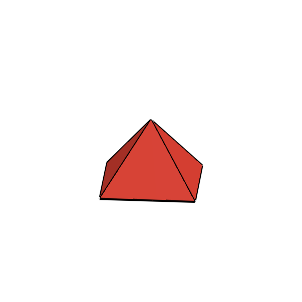 | **Square Pyramid** | Pyramids & Caps | 5 | 8 | 5 | 4 Triangles, 1 Square |
| **$J_2$** | 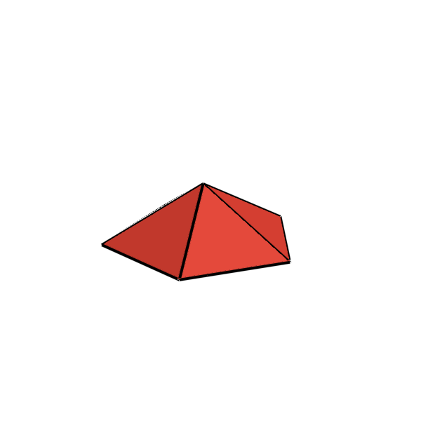 | **Pentagonal Pyramid** | Pyramids & Caps | 6 | 10 | 6 | 5 Triangles, 1 Pentagon |
| **$J_3$** | 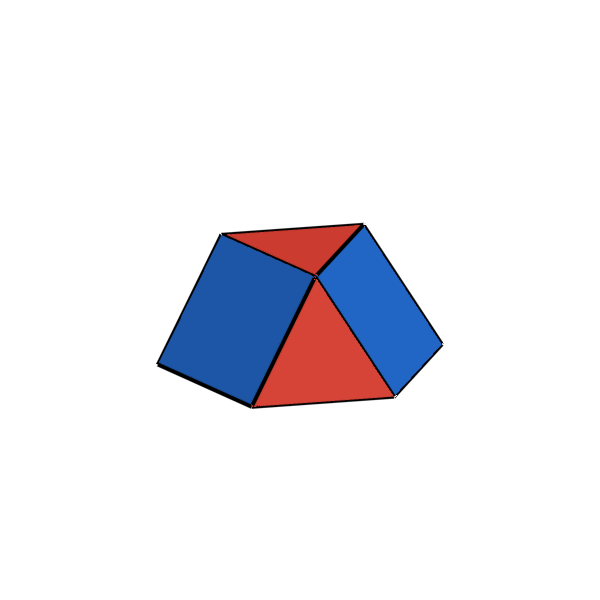 | **Triangular Cupola** | Cupolae | 9 | 15 | 8 | 4 Triangles, 3 Squares, 1 Hexagon |
| **$J_4$** | 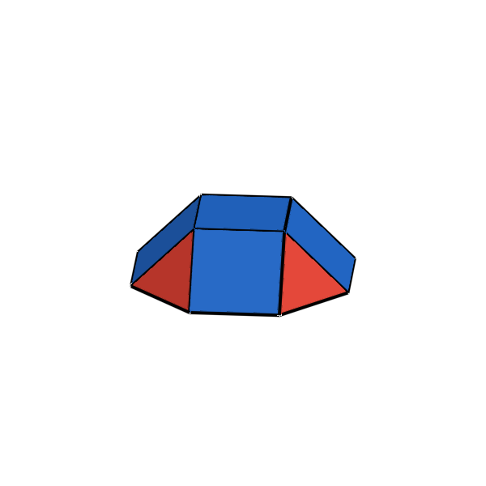 | **Square Cupola** | Cupolae | 12 | 24 | 10 | 4 Triangles, 5 Squares, 1 Octagon |
| **$J_5$** | 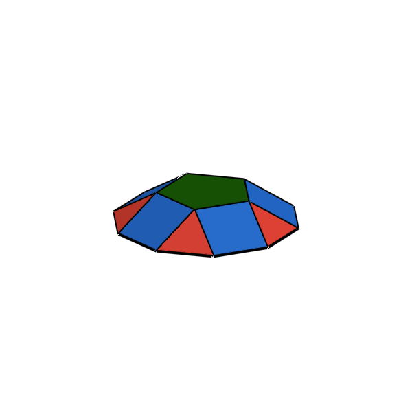 | **Pentagonal Cupola** | Cupolae | 15 | 30 | 12 | 5 Triangles, 5 Squares, 1 Decagon |
| **$J_6$** | 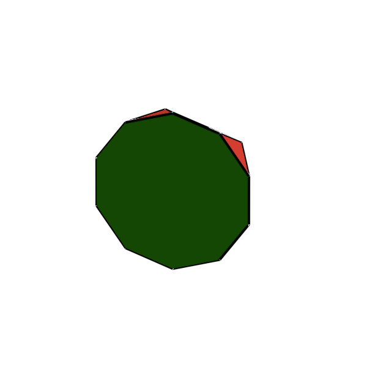 | **Pentagonal Rotunda** | Rotundae (Half-Icosidodecahedron) | 20 | 35 | 17 | 10 Triangles, 6 Pentagons, 1 Decagon |
| **$J_{26}$** | 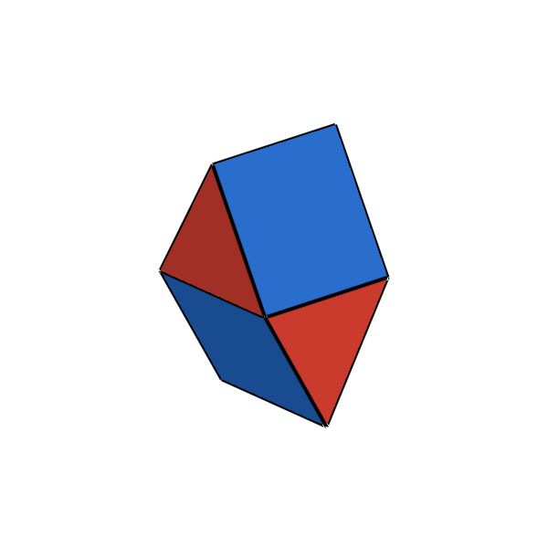 | **Gyrobifastigium** | Space-filling Johnson Solid | 8 | 14 | 8 | 4 Triangles, 4 Squares |
| **$J_{84}$** | 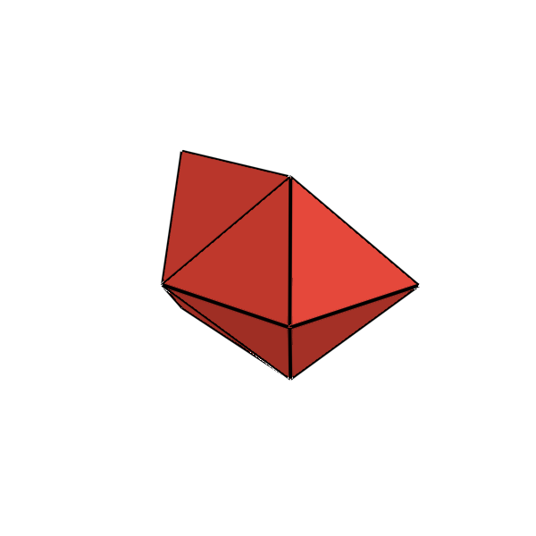 | **Snub Disphenoid** | Elementary Deltahedron | 8 | 18 | 12 | 12 Equilateral Triangles |
| **$J_{85}$** | 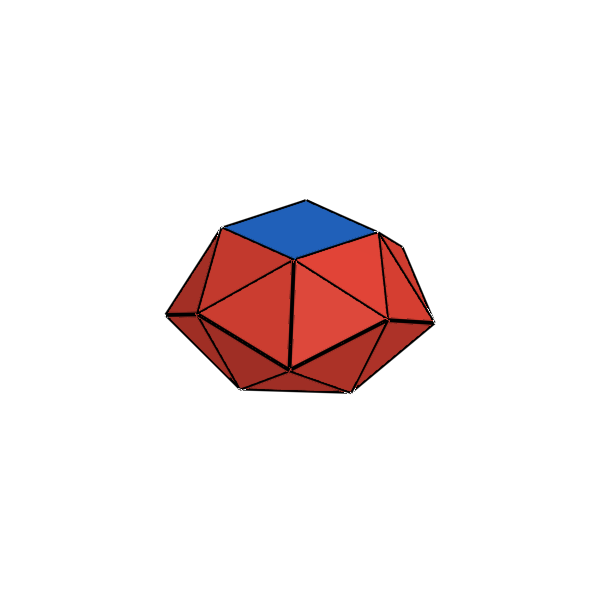 | **Snub Square Antiprism** | Elementary Johnson | 16 | 40 | 26 | 24 Triangles, 2 Squares |
| **$J_{86}$** | 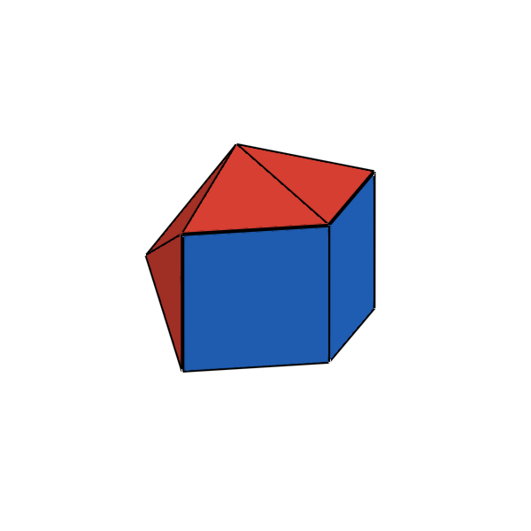 | **Sphenocorona** | Elementary Johnson (Crown) | 10 | 22 | 14 | 12 Triangles, 2 Squares |
| **$J_{87}$** | 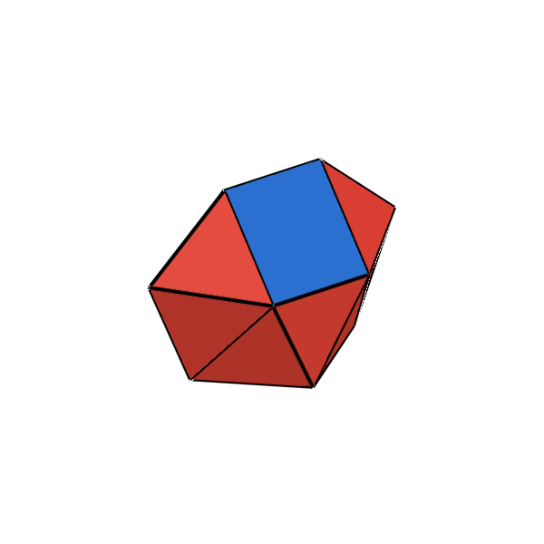 | **Sphenomegacorona** | Elementary Johnson (Large Crown) | 12 | 26 | 16 | 12 Triangles, 4 Squares |
| **$J_{88}$** | 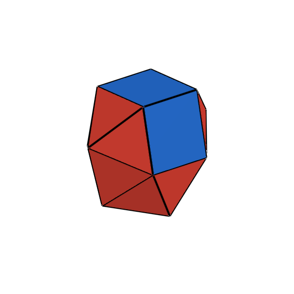 | **Hebesphenomegacorona** | Elementary Johnson (Blunted Crown) | 14 | 33 | 21 | 18 Triangles, 3 Squares |
| **$J_{89}$** | 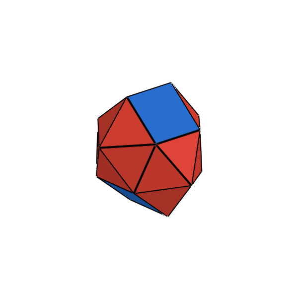 | **Disphenocingulum** | Elementary Johnson (Girdle) | 16 | 38 | 24 | 20 Triangles, 4 Squares |
| **$J_{90}$** | 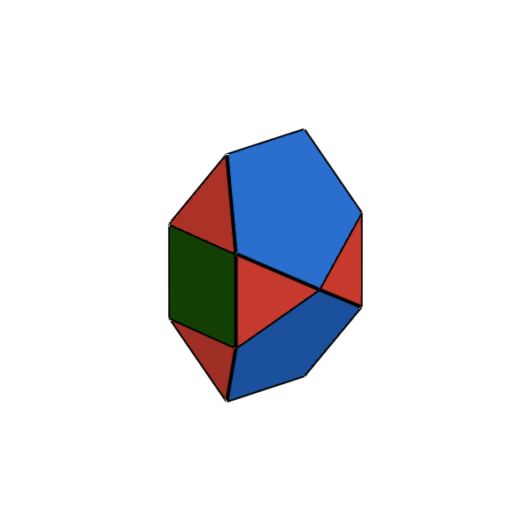 | **Bilunabirotunda** | Elementary Johnson (Lunes & Pentagons) | 14 | 26 | 14 | 8 Triangles, 2 Squares, 4 Pentagons |
| **$J_{91}$** | 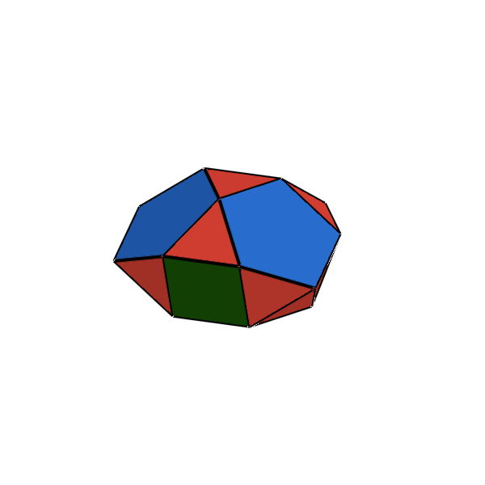 | **Triangular Hebesphenorotunda** | Elementary Johnson | 18 | 36 | 20 | 13 Triangles, 3 Squares, 3 Pentagons, 1 Hexagon |

---

## 4. Julia API Usage

```julia
using Unihedron

# Access by dedicated constructor
pyr = square_pyramid()
cup = triangular_cupola()
gbf = gyrobifastigium()
sd  = snub_disphenoid()

# Access by index or symbol dispatcher (:J1 to :J92)
j1  = johnson(1)                 # Square pyramid (index 1 to 92)
j84 = johnson(:J84)              # Snub disphenoid
j90 = johnson(:bilunabirotunda)

# Query Johnson metadata & names
names = johnson_names()
println("Total Johnson Solids: ", length(names))  # 92
```
