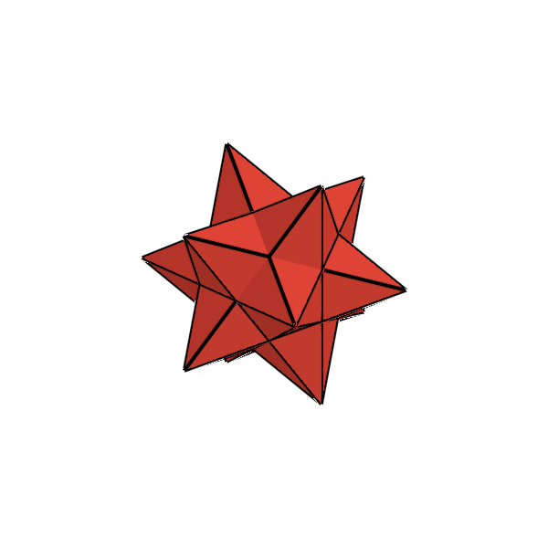
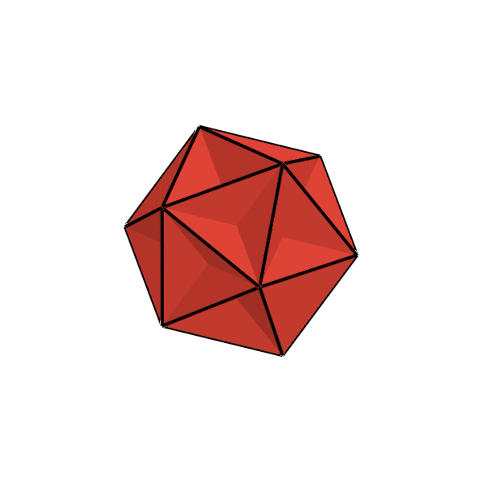
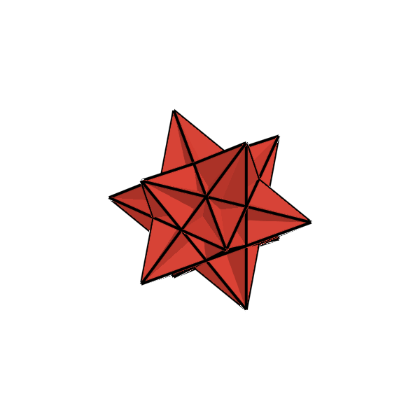

# The Kepler-Poinsot Polyhedra (Regular Star Polyhedra)

**Named after Johannes Kepler (1571–1630), who described the two stellated dodecahedra in *Harmonices Mundi* (1619), and Louis Poinsot (1777–1859), who discovered the remaining two regular star polyhedra in his 1810 paper *Mémoire sur les polygones et les polyèdres*.**

---

## 1. Historical & Mathematical Context

The Kepler-Poinsot polyhedra are the **only four regular non-convex (star) polyhedra**. They are explicitly polyhedra rather than solids due to their self-intersecting structure.

* **Johannes Kepler** (1619) constructed the *Small Stellated Dodecahedron* and *Great Stellated Dodecahedron* by extending (stellating) the pentagonal faces of the Platonic dodecahedron until they intersected into regular pentagrams $\{5/2\}$.
* **Louis Poinsot** (1810) discovered the dual pair: the *Great Dodecahedron* (intersecting regular pentagons with 5 pentagons meeting at each star vertex) and the *Great Icosahedron* (intersecting regular triangles arranged in 5-fold stars).
* **Augustin-Louis Cauchy** (1813) proved that this list of four regular star polyhedra is **complete**—no other regular non-convex polyhedra can exist in 3D Euclidean space.

---

## 2. Defining Axioms & Rules

To qualify as a Kepler-Poinsot polyhedron, the structure must satisfy all of the following rules:

1. **Regularity**: Every face is a congruent regular polygon (either a convex polygon or a regular star polygon $\{5/2\}$ with 5 vertices).
2. **Vertex-Transitivity**: All vertices are uniform—the exact same arrangement of intersecting faces meets at every vertex.
3. **Non-Convexity (Self-Intersection)**: Faces and edges intersect each other, passing through interior chambers.
4. **Regular Star / Vertex Figure**: Either the faces are star polygons or the vertex figures form star polygons.

---

## 3. The 4 Kepler-Poinsot Polyhedra Table

| Index | Preview | Name | Schläfli Symbol | Vertices ($V$) | Edges ($E$) | Faces ($F$) | Face Polygon | Dual Polyhedron |
| :---: | :---: | :--- | :---: | :---: | :---: | :--- | :---: | :--- |
| **$KP_1$** |  | **Small Stellated Dodecahedron** | $\{5/2, 5\}$ | 12 | 30 | 12 | 12 Pentagrams $\{5/2\}$ | Great Dodecahedron |
| **$KP_2$** |  | **Great Dodecahedron** | $\{5, 5/2\}$ | 12 | 30 | 12 | 12 Regular Pentagons | Small Stellated Dodecahedron |
| **$KP_3$** |  | **Great Stellated Dodecahedron** | $\{5/2, 3\}$ | 20 | 30 | 12 | 12 Pentagrams $\{5/2\}$ | Great Icosahedron |
| **$KP_4$** |  | **Great Icosahedron** | $\{3, 5/2\}$ | 12 | 30 | 20 | 20 Equilateral Triangles | Great Stellated Dodecahedron |

---

## 4. Julia API Usage

```julia
using Unihedron

# Access by dedicated constructor
ssd = small_stellated_dodecahedron()
gd  = great_dodecahedron()
gsd = great_stellated_dodecahedron()
gi  = great_icosahedron()

# Access by index or symbol dispatcher
kp1 = kepler_poinsot(1)                                # Small Stellated Dodecahedron
kp3 = kepler_poinsot(:great_stellated_dodecahedron)

# Dual relations
@assert dual(small_stellated_dodecahedron()) == great_dodecahedron()
```
