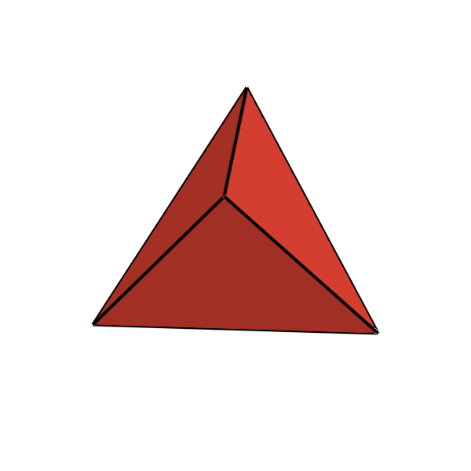
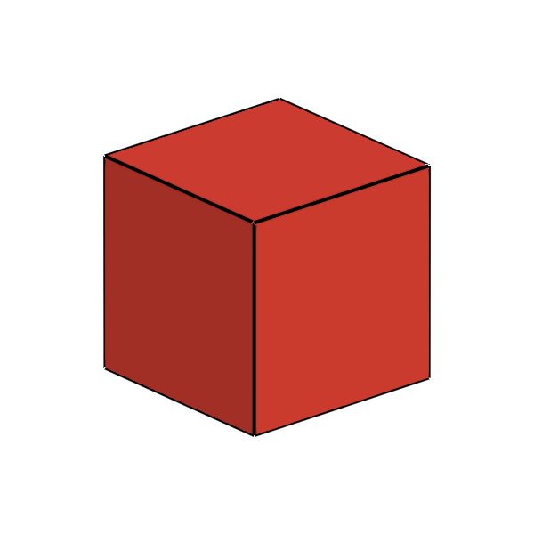
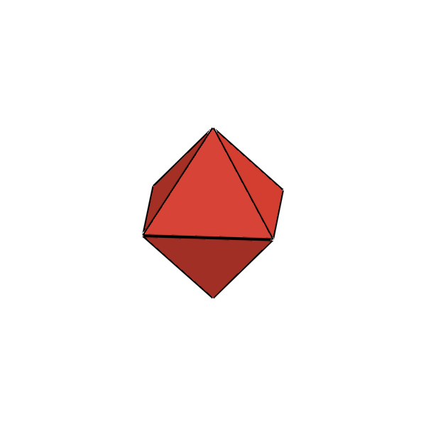
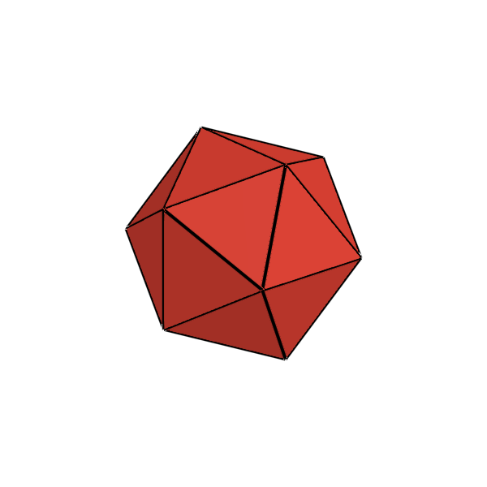

# The Platonic Solids (Regular Convex Polyhedra)

**Named after the ancient Greek philosopher Plato (~428/427 – 348/347 BC), who described them in the dialogue *Timaeus* (~360 BC).**

---

## 1. Historical & Mathematical Context

The five Platonic solids are the only regular, strictly convex polyhedra in 3-dimensional Euclidean space. While discovered empirically by prehistoric cultures (notably neolithic Scottish carved stone balls) and studied by the Pythagoreans (~5th century BC) and Theaetetus of Athens (who provided the first rigorous mathematical proofs and constructions), they are historically named after **Plato**, who associated each solid with a classical element of the universe in *Timaeus*:
* **Tetrahedron**: Fire (sharp, penetrating vertices)
* **Cube (Hexahedron)**: Earth (solid, unshakeable base)
* **Octahedron**: Air (light, smooth symmetry)
* **Icosahedron**: Water (smooth, flowing shape with many faces)
* **Dodecahedron**: The Cosmos / Quintessence (the shape used by the Creator for arranging the constellations on the celestial sphere)

The classification was famously culminated in Book XIII of Euclid's *Elements* (~300 BC), where Euclid proved that there can exist **exactly five** regular convex polyhedra.

---

## 2. Defining Axioms & Rules

To qualify as a Platonic solid, a polyhedron must satisfy all of the following rules:

1. **Regularity of Faces**: Every face is a congruent regular polygon (all sides and interior angles identical).
2. **Vertex-Transitivity (Isogonality)**: Every vertex is surrounded by the exact same arrangement and number of faces.
3. **Strict Convexity**: Every dihedral angle between adjacent faces is $< 180^\circ$.
4. **Planarity & Non-Self-Intersection**: Faces do not self-intersect or penetrate.

From the angle defect at a vertex (where the sum of face angles meeting at any vertex must strictly be $< 360^\circ$), only five combinations are mathematically possible:
* Three $60^\circ$ equilateral triangles: $3 \times 60^\circ = 180^\circ$ $\to$ **Tetrahedron**
* Four $60^\circ$ equilateral triangles: $4 \times 60^\circ = 240^\circ$ $\to$ **Octahedron**
* Five $60^\circ$ equilateral triangles: $5 \times 60^\circ = 300^\circ$ $\to$ **Icosahedron**
* Three $90^\circ$ squares: $3 \times 90^\circ = 270^\circ$ $\to$ **Cube**
* Three $108^\circ$ regular pentagons: $3 \times 108^\circ = 324^\circ$ $\to$ **Dodecahedron**

---

## 3. The 5 Platonic Solids Table

| Index | Preview | Name | Schläfli Symbol | Vertices ($V$) | Edges ($E$) | Faces ($F$) | Face Polygon | Dual Solid | Symmetry Group |
| :---: | :---: | :--- | :---: | :---: | :---: | :---: | :--- | :--- | :--- |
| **$P_1$** |  | **Regular Tetrahedron** | $\{3, 3\}$ | 4 | 6 | 4 | 4 Equilateral Triangles | Self-dual | $T_d$ (Tetrahedral) |
| **$P_2$** |  | **Regular Hexahedron (Cube)** | $\{4, 3\}$ | 8 | 12 | 6 | 6 Squares | Octahedron | $O_h$ (Octahedral) |
| **$P_3$** |  | **Regular Octahedron** | $\{3, 4\}$ | 6 | 12 | 8 | 8 Equilateral Triangles | Cube | $O_h$ (Octahedral) |
| **$P_4$** |  | **Regular Dodecahedron** | $\{5, 3\}$ | 20 | 30 | 12 | 12 Regular Pentagons | Icosahedron | $I_h$ (Icosahedral) |
| **$P_5$** |  | **Regular Icosahedron** | $\{3, 5\}$ | 12 | 30 | 20 | 20 Equilateral Triangles | Dodecahedron | $I_h$ (Icosahedral) |

---

## 4. Julia API Usage

```julia
using Unihedron

# Access by dedicated constructor
t = tetrahedron(; radius=1.0)
c = cube(; radius=1.0)
o = octahedron(; radius=1.0)
d = dodecahedron(; radius=1.0)
i = icosahedron(; radius=1.0)

# Access by symbol or index dispatcher
p1 = platonic(:tetrahedron)
p4 = platonic(:dodecahedron)
p5 = platonic(5)  # 1 to 5

# Geometric dual computation
octa = dual(cube())
```
